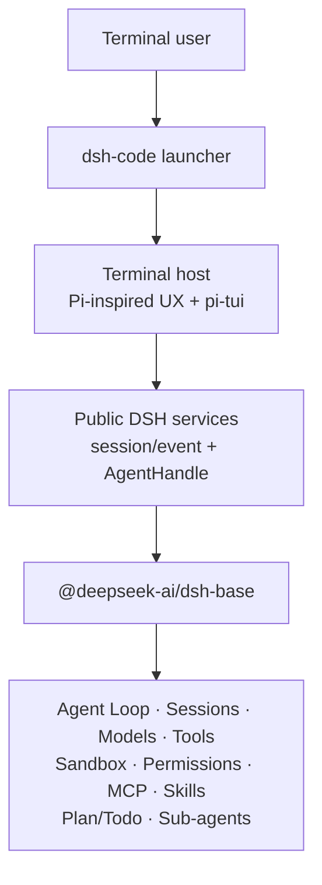

<p align="center">
  
</p>

<h1 align="center">dsh-code</h1>

<p align="center">
  A DeepSeek Harness terminal coding agent for developers who prefer a focused TUI workflow.
</p>

<p align="center">
  <strong>English</strong> · <a href="README.zh-CN.md">简体中文</a>
</p>

<p align="center">
  <a href="https://github.com/guoxiucai/dsh-code/actions/workflows/ci.yml"></a>
  <a href="LICENSE"></a>
  
  <a href="https://github.com/deepseek-ai/deepseek-harness"></a>
</p>

> [!IMPORTANT]
> `dsh-code` is an independent community project, not an official DeepSeek
> distribution. DeepSeek Harness is also in developer preview, so
> compatibility-breaking upstream changes may occur between pinned baselines.

## Why dsh-code?

[DeepSeek Harness](https://github.com/deepseek-ai/deepseek-harness) provides an
official Web UI and a plugin-first agent runtime. `dsh-code` is for developers
who prefer to stay in the terminal: it packages the same DSH agent semantics in
a compact, keyboard-driven interface that works naturally beside shells,
editors, Git, and remote development environments.

The product draws on the interaction ideas of
[Pi](https://github.com/earendil-works/pi) and uses
[`@earendil-works/pi-tui`](https://www.npmjs.com/package/@earendil-works/pi-tui)
for terminal rendering. It does **not** fork or replace the agent core. The Agent
Loop, sessions, model adapters, tools, sandbox, permissions, MCP, Skills,
Plan/Todo, and sub-agents remain owned by the pinned DSH runtime.

In short:

```text
DeepSeek Harness agent runtime + Pi-inspired terminal UX + pi-tui renderer
```

## Preview

<p align="center">
  
</p>

## Highlights

- **Terminal-native workflow** — streaming Markdown, a five-line live reasoning
  window, line-numbered file diffs, selectable/copyable results, shell blocks,
  and a bottom-pinned composer.
- **DeepSeek Harness semantics** — uses DSH's public session/events and services;
  there is no second agent loop, session store, permission engine, or tool registry.
- **Model setup in the TUI** — configure DeepSeek, OpenAI, or an
  OpenAI-compatible endpoint through an inline, reversible wizard.
- **Safe project startup** — canonical-path trust records and `read-only`,
  `workspace-write`, or `danger-full-access` permission presets.
- **Persistent sessions** — continue the latest session, search/resume/delete
  history, inspect session statistics, fork a completed turn, and compact context.
- **Agent visibility and decisions** — dedicated Plan/Todo states, tool
  progress, retry and compaction indicators, one-shot approval bars,
  structured questions, plan review, and sub-agent activity.
- **Fast terminal controls** — slash-command completion, `@` file completion,
  direct `!` shell mode, inline selectors, and keyboard-first navigation.
- **Independent installation** — stores product data under `~/.dsh-code`, keeps
  a separately installed `dsh` command untouched, and supports explicit updates.
- **Adaptive visuals** — a DeepSeek-blue palette tuned independently for dark
  and light terminal backgrounds.

## Architecture

`dsh-code` is deliberately a thin terminal host over a fixed DSH baseline:



The launcher owns only product concerns: command parsing, `~/.dsh-code` home
isolation, project trust, session selection, profile initialization, updates,
and delegation to the upstream DSH executable. The TUI renders structured
events and sends input back through the public `AgentHandle` API.

See the accepted architecture decisions in [`docs/adr/`](docs/adr/) and the
exact upstream revision in [`UPSTREAM_BASELINE.md`](UPSTREAM_BASELINE.md).

## Requirements

| Component | Supported in the first release |
| --- | --- |
| macOS | 14 or later, Apple Silicon (`arm64`) |
| Windows | Windows 10 or later, x64 |
| Node.js | `22.19+` (Node 23 excluded) or `24+` |
| Package manager | npm for normal installation |

Linux, macOS Intel/Rosetta, Windows ARM, and standalone installations without
Node.js are not supported in the first release.

## Installation

### npm

```bash
npm install -g @tsingwill/dsh-code
```

Verify the installation:

```bash
dsh-code --version
dsh-code --help
```

The scoped npm package is `@tsingwill/dsh-code`; the installed command remains
the shorter `dsh-code`.

### Build from source

```bash
git clone --recurse-submodules https://github.com/guoxiucai/dsh-code.git
cd dsh-code
corepack enable
corepack prepare pnpm@11.7.0 --activate
pnpm install --frozen-lockfile
pnpm run build:lib
pnpm run build
node lib/bin.js
```

## Quick start

```bash
cd /path/to/your/project
dsh-code
```

On the first launch for a project:

1. Review the canonical project path and choose a permission preset.
2. If `~/.dsh-code/.credentials.yaml` has no saved API credential, dsh-code
   automatically opens the inline provider setup.
3. Select a provider, save the first API token and default model, then send a
   task in the editor. Use `/config` later to add or change providers.

For the official DeepSeek API, `/config` asks for the API key and default model.
For an OpenAI-compatible service, the wizard keeps five explicit values:

1. provider route ID;
2. base URL;
3. credential environment-variable name (pre-filled from the route ID);
4. API key;
5. model ID.

The wizard uses DeepSeek-compatible examples, supports `Esc` to return to the
previous step, and writes values only after the final step succeeds. Credentials
are stored owner-only in `~/.dsh-code/.credentials.yaml`.

## Usage

### Command line

| Command | Description |
| --- | --- |
| `dsh-code` | Start a new interactive TUI session |
| `dsh-code -c`, `--continue` | Continue the latest session for this project |
| `dsh-code -r`, `--resume` | Open the searchable session picker |
| `dsh-code resume [session-id]` | Resume a selected or explicit session |
| `dsh-code -p "<task>"` | Run one headless task and print the final answer |
| `dsh-code -p "<task>" --approve` | Trust the project non-interactively using `workspace-write` |
| `dsh-code plugin <command>` | Delegate profile plugin management to DSH (requires pnpm) |
| `dsh-code update --check` | Check the stable npm channel for an update |
| `dsh-code update` | Confirm and install the available update |
| `dsh-code update --channel next` | Select the release-candidate channel |

### Interactive commands

| Command | Description |
| --- | --- |
| `/config` | Configure DeepSeek, OpenAI, or an OpenAI-compatible provider |
| `/model` | Switch the active model using an inline selector |
| `/permission` | Select the active permission preset |
| `/goal` | View and manage the upstream DSH long-running goal inline |
| `/skills [search]` | Discover skills; Space toggles dsh-code-only enablement and Enter invokes the selected skill |
| `/agents` | Inspect the current session's persisted subagent tree |
| `/mcp` | View MCP servers grouped by DSH/Codex/Claude source with live status, then import or remove them |
| `/rename [title]` | Rename and pin the current session title |
| `/jobs` | Inspect output or stop background jobs owned by this session |
| `/export [path]` | Export the current session as Markdown or JSONL |
| `/session` | Show session, message, tool, model, and token statistics |
| `/fork` | Fork at the most recent completed turn |
| `/compact` | Compact the current context through DSH |
| `/quit`, `/exit` | Exit when the agent is idle |
| `!<command>` | Run a shell/PowerShell command without sending it to the model |

Additional commands supplied by the pinned DSH profile remain discoverable
through `/` autocomplete.

### Essential keys

| Key | Action |
| --- | --- |
| `Enter` | Send input or confirm an inline selection |
| `Esc` | Go back/cancel an inline step; interrupt the active turn |
| `Ctrl+C` / `Command+C` | Copy the selected result text; never interrupts the active turn |
| `Ctrl+O` | Expand or collapse reasoning (latest 5 lines by default) and tool output |
| `Ctrl+D` | Exit when idle |
| `/` | Open command completion |
| `@` | Complete project files (`fd` enables faster fuzzy discovery) |

### Approvals and structured questions

When a tool requests sandbox escalation or a hook returns `ask`, dsh-code pins
a one-shot **Allow once / Reject** bar above the composer. The choice applies
only to that request; `Esc` cancels it and does not create a persistent grant.

The DSH `ask_user_question` tool and plan-mode review use the same bottom-pinned
interaction area. Single-choice questions submit immediately; multi-choice
questions use `Space` to toggle entries and `Enter` on **Continue** to submit.
Select **Type an answer…** and press `Enter` to edit that same row in place; no
panel content shifts. While editing, `Esc` returns to the preceding menu. Long
plan Markdown is bounded to six lines and scrolls with
`PgUp` / `PgDn`. Parallel requests are queued so one prompt cannot replace
another.

## Sessions, configuration, and isolation

By default all dsh-code state lives under `~/.dsh-code`:

```text
~/.dsh-code/
├── .credentials.yaml       # owner-only provider credentials
├── profiles/dsh-code/      # fixed DSH profile + terminal host patch
├── projects/               # canonical-path trust records
└── sessions/               # persisted sessions grouped by project
```

Set `DSH_CODE_HOME` to use a different root. On launch, dsh-code sets the
delegated `DSH_HOME` to this isolated directory and disables DSH telemetry. It
does not import or overwrite standalone DSH settings, credentials, sessions,
plugins, or MCP configuration, so a globally installed upstream `dsh` binary
remains independent. The bundled DSH skill registry does perform read-only
discovery from compatible skill roots: project `.dsh/.agents/.codex/.claude`,
dsh-code user `~/.dsh-code/skills`, and user `~/.dsh/.agents/.codex/.claude`
skill directories. dsh-code does not install, delete, copy, or update those
skills; `/skills` reports the winning upstream registry entry and its source in
a single-level picker. Space enables or disables the selected entry and Enter
places an enabled, user-invocable skill in the editor.
Its enable/disable switch is a dsh-code-only overlay stored at
`~/.dsh-code/skill-preferences.json`; it never edits the source `SKILL.md` or
changes another product's skill state. A disabled skill is hidden from both the
model catalog and user slash invocation in dsh-code.

Project MCP configuration is written to `.dsh-code/cordis.patch.yml` inside the
trusted project and takes effect on the next launch. The `/mcp` view groups
servers by their standalone DSH, OpenAI Codex, Claude Code, or dsh-code source
file. A green `● connected` means the current Agent has registered at least one
tool from that server; an unconnected server is shown in gray. Selecting an
external entry copies it into dsh-code's project patch without changing its
source. Imported environment or header values can contain credentials;
this repository gitignores that patch, and other projects should do the same
before importing credential-bearing servers.

## Updating

Updates are explicit; dsh-code does not silently update itself:

```bash
dsh-code update --check
dsh-code update
dsh-code update --channel next
dsh-code update --version 0.1.0-rc.1
```

The update command is supported for npm-global installations. Source checkouts
should be updated with Git and rebuilt with the same tool that installed them.

## Development and verification

```bash
pnpm run typecheck
pnpm test
pnpm run build
```

The repository pins DeepSeek Harness as the `deepseek-harness/` git submodule.
Product code stays at the repository root; upstream changes belong in a
dedicated baseline update or should be contributed to DSH first.

Release design, platform compilation, candidate verification, and the update
strategy are documented in [`docs/NPM_RELEASE.md`](docs/NPM_RELEASE.md).

## Contributing and security

- Read [`CONTRIBUTING.md`](CONTRIBUTING.md) before opening a pull request.
- Use [GitHub Issues](https://github.com/guoxiucai/dsh-code/issues) for public
  bug reports and feature requests.
- Report vulnerabilities privately as described in [`SECURITY.md`](SECURITY.md).
- Never attach unredacted API keys, session logs, credentials, or crash logs.

## Relationship and attribution

`dsh-code` is a downstream, independent community project. It is not affiliated
with or endorsed by DeepSeek AI or the Pi maintainers.

- Agent runtime: [DeepSeek Harness](https://github.com/deepseek-ai/deepseek-harness)
- TUI renderer and interaction inspiration: [Pi](https://github.com/earendil-works/pi)
- Product distribution and terminal host: this repository

The dsh-code terminal-whale logo adapts the official DeepSeek whale silhouette
with a terminal window and prompt. The DeepSeek name and official whale artwork
belong to their respective owners; see [`NOTICE`](NOTICE) for complete attribution.

## License

[MIT](LICENSE) © 2026 guoxiucai. Third-party notices are listed in
[`THIRD_PARTY_NOTICES.md`](THIRD_PARTY_NOTICES.md).
