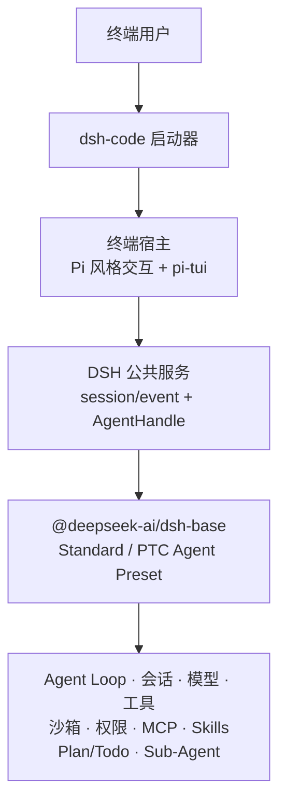

<p align="center">
  
</p>

<h1 align="center">dsh-code</h1>

<p align="center">
  面向偏好 TUI 工作流开发者的 DeepSeek Harness 终端编程 Agent。
</p>

<p align="center">
  <a href="README.md">English</a> · <strong>简体中文</strong>
</p>

<p align="center">
  <a href="https://github.com/guoxiucai/dsh-code/actions/workflows/ci.yml"></a>
  <a href="LICENSE"></a>
  
  <a href="https://github.com/deepseek-ai/deepseek-harness"></a>
</p>

> [!IMPORTANT]
> `dsh-code` 是独立的社区项目，并非 DeepSeek 官方发行版。DeepSeek Harness
> 本身也处于开发者预览阶段，在升级固定基线时可能出现不兼容变更。

## 为什么有 dsh-code？

[DeepSeek Harness](https://github.com/deepseek-ai/deepseek-harness) 已提供官方
Web UI 和插件优先的 Agent Runtime。`dsh-code` 面向更习惯留在终端中的开发者：
它将同一套 DSH Agent 语义封装成紧凑的键盘驱动界面，适合与 Shell、编辑器、
Git 和远程开发环境配合使用。

产品借鉴了 [Pi](https://github.com/earendil-works/pi) 的终端交互思想，并使用
[`@earendil-works/pi-tui`](https://www.npmjs.com/package/@earendil-works/pi-tui)
完成终端渲染，但**没有**复制或替换 Agent 核心。Agent Loop、会话、模型适配器、
工具、沙箱、权限、MCP、Skills、Plan/Todo 和 Sub-Agent 仍由固定版本的 DSH Runtime
负责。

简而言之：

```text
DeepSeek Harness Agent Runtime + Pi 风格终端交互 + pi-tui 渲染器
```

## 环境要求

| 组件 | 首个版本支持范围 |
| --- | --- |
| macOS | macOS 14 或更高，Apple Silicon (`arm64`) |
| Windows | Windows 10 或更高，x64 |
| Node.js | `22.19+`（不含 Node 23）或 `24+` |
| 包管理器 | 普通安装只需要 npm |

首个版本暂不支持 Linux、macOS Intel/Rosetta、Windows ARM，以及不安装 Node.js 的
独立可执行文件分发方式。

## 安装

### npm 安装

```bash
npm install -g @tsingwill/dsh-code
```

如需安装当前候选版本而不是稳定通道：

```bash
npm install -g @tsingwill/dsh-code@next
```

验证安装结果：

```bash
dsh-code --version
dsh-code --help
```

npm 包名是 `@tsingwill/dsh-code`，安装后的终端命令仍是简短的 `dsh-code`。

### 从源码构建

```bash
git clone --recurse-submodules https://github.com/guoxiucai/dsh-code.git
cd dsh-code
corepack enable
corepack prepare pnpm@11.7.0 --activate
pnpm install --frozen-lockfile
pnpm run build:lib
pnpm run build
node lib/bin.js
```

## 功能展示

<p align="center">
  
</p>

## 功能亮点

- **终端原生工作流**：流式 Markdown、默认五行折叠的思考与长工具正文、始终完整展示的
  带行号文件 Diff、可选中复制的结果、主题色粘贴标记、Shell 结果块和底部固定输入区。
- **Standard / PTC 双模式**：默认 Standard 直接调用工具；PTC 用一个 TypeScript 程序
  编排多步工具操作。PTC 子调用按原生工具行展示，长正文默认折叠，文件 Diff 始终完整。
- **复用 DeepSeek Harness 语义**：只使用 DSH 的公共 Session/Event 和服务接口，
  不维护第二套 Agent Loop、会话存储、权限引擎或工具注册表。
- **TUI 内完成模型配置**：通过可回退的内联向导配置 DeepSeek、OpenAI 或
  OpenAI-compatible 服务。
- **安全的项目启动流程**：按规范化绝对路径记录信任状态，支持 `read-only`、
  `workspace-write`、`danger-full-access` 三种权限预设。
- **持久化会话**：新建、恢复、搜索和删除历史会话，从历史请求前 Fork，
  克隆当前快照，查看会话统计，以及压缩上下文。
- **清晰的 Agent 状态与决策交互**：独立的 Plan/Todo 状态、用户消息排队提示、工具进度、
  重试与压缩提示、一次性审批条、结构化问题、计划评审，以及可点击并支持取消/移除的
  Sub-Agent 运行状态。
- **高效终端操作**：`/` 命令补全、`@` 文件与文件夹模糊联想、`!` Shell 模式、
  内联选择器和键盘导航。
- **独立安装与数据目录**：数据保存在 `~/.dsh-code`，不会覆盖单独安装的 `dsh`，
  并提供显式更新命令。
- **自适应视觉主题**：DeepSeek 蓝主题分别针对暗色和亮色终端背景优化。

## 架构说明

`dsh-code` 有意保持为固定 DSH 基线之上的轻量终端宿主：



启动器只负责产品层能力：命令解析、`~/.dsh-code` 数据隔离、项目信任、会话选择、
Profile 初始化、产品更新，以及委托上游 DSH 启动。TUI 只渲染结构化事件，并通过
公共 `AgentHandle` API 把用户输入送回 Agent。
TUI 只开放上游 `standard`（Standard）与 `ptc`（PTC）两个 Agent Preset。新会话默认
Standard，可通过启动参数或首轮前的 `/mode` 选择 PTC；首轮开始后模式锁定，恢复会话
始终按事件日志中记录的模式重建，避免在已有工具历史中途更换 schema。

架构约束见 [`docs/adr/`](docs/adr/)，固定的上游版本见
[`UPSTREAM_BASELINE.md`](UPSTREAM_BASELINE.md)。

## 快速开始

```bash
cd /path/to/your/project
dsh-code
```

首次在某个项目中启动时：

1. 核对规范化后的项目路径并选择权限预设；
2. 如果 `~/.dsh-code/.credentials.yaml` 尚未保存任何 API Credential，dsh-code
   会自动打开内联 Provider 配置向导；
3. 选择服务商，保存第一个 API Token 和默认模型，然后在输入框中发送任务。后续可使用
   `/config` 添加或修改服务商。

选择 DeepSeek 官方 API 时，`/config` 会要求填写 API Key 并选择默认模型。
选择 OpenAI-compatible 服务时，向导会明确配置五项内容：

1. Provider Route ID；
2. Base URL；
3. Credential 环境变量名（根据 Route ID 自动预填）；
4. API Key；
5. Model ID。

向导中的示例以 DeepSeek-compatible 服务为准；按 `Esc` 可以回到上一步，只有最后
一步成功后才会写入配置。Credential 以仅当前用户可读的权限保存在
`~/.dsh-code/.credentials.yaml`。

## 使用说明

### 命令行

| 命令 | 说明 |
| --- | --- |
| `dsh-code` | 启动新的交互式 TUI 会话 |
| `dsh-code --mode standard\|ptc` | 以 Standard 或 PTC 模式启动新会话 |
| `dsh-code -c`、`--continue` | 继续当前项目最近一次会话 |
| `dsh-code -r`、`--resume` | 打开可搜索的会话选择器 |
| `dsh-code resume [session-id]` | 选择或指定会话进行恢复 |
| `dsh-code -p "<任务>"` | 以 Headless 模式执行一次任务并输出最终答案 |
| `dsh-code -p "<任务>" --approve` | 非交互信任项目，使用 `workspace-write` 权限 |
| `dsh-code plugin <命令>` | 委托 DSH 管理 Profile 插件（需要 pnpm） |
| `dsh-code update --check` | 检查 npm stable 渠道是否有更新 |
| `dsh-code update` | 确认并安装可用更新 |
| `dsh-code update --channel next` | 切换到 RC 更新渠道 |

### TUI 内置命令

| 命令 | 说明 |
| --- | --- |
| `/config` | 配置 DeepSeek、OpenAI 或 OpenAI-compatible 服务 |
| `/model` | 使用内联选择器切换当前模型 |
| `/mode [standard\|ptc]` | 选择当前空白会话的模式；首轮开始后不可切换 |
| `/permission` | 选择当前权限预设 |
| `/goal` | 内联查看和管理上游 DSH 长期目标 |
| `/skills [搜索词]` | 发现 Skill；Space 仅对 dsh-code 启停，Enter 直接调用选中项 |
| `/agents` | 查看当前活跃 Sub-Agent，并在内联列表中取消或移除任务 |
| `/mcp` | 管理 dsh-code 用户级/项目级 MCP 及实时状态；按需从 DSH/Codex/Claude 导入独立副本 |
| `/rename [标题]` | 重命名并固定当前会话标题 |
| `/jobs` | 查看输出或停止当前会话的后台任务 |
| `/export [路径]` | 将当前会话导出为 Markdown 或 JSONL |
| `/session` | 查看会话、消息、工具、模型与 Token 统计 |
| `/new` | 切换到新的空 Standard 会话 |
| `/resume` | 打开带父子层级的全屏会话选择器并切换到所选会话 |
| `/fork` | 从选中的历史用户请求之前创建分支，并自动切换到新会话 |
| `/clone` | 克隆当前会话快照并自动切换到克隆会话 |
| `/web` | 挂起 TUI，打开 dsh-code 随包上游 DSH Web；Web 停止后重新加载当前会话 |
| `/compact` | 通过 DSH 压缩当前上下文 |
| `/quit`、`/exit` | Agent 空闲时退出 |
| `!<命令>` | 直接执行 Shell/PowerShell 命令，不发送给模型 |

固定 DSH Profile 提供的其他命令可以通过 `/` 自动补全发现。

`/web` 运行期间，终端只显示生命周期状态，不再接受对话输入。关闭浏览器标签不会停止本地 Web
进程；在终端按 `Esc` 可安全停止 Web 并返回重新加载后的 TUI，按 `Ctrl+D` 则停止 Web 并退出
dsh-code。

### 常用按键

| 按键 | 操作 |
| --- | --- |
| `Enter` | 发送内容或确认内联选择 |
| `Esc` | 返回/取消当前内联步骤；Agent 运行时中断当前轮次 |
| `Ctrl+C` / `Command+C` | 复制结果区域中选中的文本，不再中断当前轮次 |
| `Ctrl+O` | 展开/折叠思考与长工具正文（默认 5 个视觉行）；文件 Diff 始终展开 |
| `Ctrl+D` | Agent 空闲时退出 |
| `/` | 打开命令补全 |
| `@` | 模糊联想项目文件和文件夹；安装 `fd` 后可获得更快查找 |

### 审批与结构化问题

工具请求沙箱升级或 Hook 返回 `ask` 时，dsh-code 会在输入区域上方固定显示一次性的
**Allow once / Reject** 审批条。选择只作用于本次请求，不会写入长期授权；按 `Esc`
取消本次审批。

DSH 的 `ask_user_question` 工具与 Plan 模式评审共用同一块底部固定交互区。单选题选择后
直接提交；多选题使用 `Space` 勾选，移动到 **Continue** 后按 `Enter` 提交。选择
**Type an answer…** 后按 `Enter`，会直接在占位行原位输入，面板内容不会跳动；输入状态下
按 `Esc` 返回上一步菜单。较长的计划 Markdown 固定显示最多 6 行，可用 `PgUp` / `PgDn`
滚动。并发交互请求会串行排队，避免后来的问题覆盖正在回答的问题。

## 会话、配置与数据隔离

默认情况下，dsh-code 的全部状态都保存在 `~/.dsh-code`：

```text
~/.dsh-code/
├── .credentials.yaml       # 仅当前用户可读的服务商 Credential
├── profiles/dsh-code/      # 固定 DSH Profile 与终端宿主 Patch
├── projects/               # 按规范化路径保存的项目信任记录
└── sessions/               # 按项目分组的持久化会话
```

通过 `DSH_CODE_HOME` 可以修改根目录。启动时 dsh-code 会把委托进程的 `DSH_HOME`
指向这个独立目录，并禁用 DSH Telemetry。它不会导入或覆盖独立 DSH 的设置、凭据、
会话、插件和 MCP 配置，因此全局安装的上游 `dsh` 命令仍保持独立。作为唯一例外，
内置 DSH Skill Registry 会只读发现兼容目录：项目的 `.dsh/.agents/.codex/.claude`、
dsh-code 用户目录 `~/.dsh-code/skills`，以及用户目录下
`~/.dsh/.agents/.codex/.claude` 的 Skills。dsh-code 不安装、删除、复制或更新这些 Skill；
`/skills` 使用单层列表展示上游 Registry 选出的生效项及其来源；Space 切换启停，Enter
把已启用且允许用户调用的 Skill 放入输入框。启停状态是
dsh-code 专属覆盖，保存在 `~/.dsh-code/skill-preferences.json`，不会修改来源 `SKILL.md`，
也不会改变其他产品中的 Skill 状态；禁用后，该 Skill 在 dsh-code 的模型目录和用户斜杠调用中均不可见。

dsh-code 的 MCP 配置分别保存在 `~/.dsh-code/mcp.json`（用户级）和可信项目的
`.dsh-code/mcp.json`（项目级）。`/mcp` 默认只展示这些归 dsh-code 所有的配置；只有选择
**Import from other agents…** 时才只读扫描独立 DSH、OpenAI Codex 和 Claude Code。
导入的是独立快照，之后不会跟随或修改来源。Space 就地启停，项目级同名配置覆盖用户级；
新增、导入、启停和删除都会在当前进程内通过上游公开 MCP Client 热更新，无需退出 dsh-code。
绿色 `● connected` 表示至少注册了一个工具，并分别显示 connecting、disabled、overridden、
error 和 not-connected 状态。导入的环境变量或 HTTP Header 可能包含凭据，因此配置在支持的
平台使用 `0600`，项目文件也已加入 Git 忽略。旧版 `.dsh-code/cordis.patch.yml` 中的 MCP row
会一次性迁移，其他项目插件 row 保持不变。
stdio Server 的 stderr 不会再直接写入备用屏幕；诊断输出保存在私有轮转日志
`~/.dsh-code/logs/mcp/<server>.stderr.log`。

## 更新

dsh-code 只执行用户明确发起的更新，不会静默升级：

```bash
dsh-code update --check
dsh-code update
dsh-code update --channel next
dsh-code update --version 0.1.2
```

更新命令仅适用于 npm 全局安装。源码检出版本应继续通过 Git 和原构建工具升级。

## 开发与验证

```bash
pnpm run typecheck
pnpm test
pnpm run build
```

仓库通过 `deepseek-harness/` Git Submodule 固定 DeepSeek Harness 版本。产品代码位于
仓库根目录；上游变更应单独升级固定基线，或者优先贡献给 DSH。

发布设计、macOS/Windows 编译、候选包验证和更新方案见
[`docs/NPM_RELEASE.md`](docs/NPM_RELEASE.md)。

## 贡献与安全

- 提交 Pull Request 前请阅读 [`CONTRIBUTING.md`](CONTRIBUTING.md)；
- 使用 [GitHub Issues](https://github.com/guoxiucai/dsh-code/issues) 公开反馈问题和建议；
- 安全漏洞请按照 [`SECURITY.md`](SECURITY.md) 私密报告；
- 不要上传未脱敏的 API Key、会话日志、Credential 或 Crash Log。

## 项目关系与致谢

`dsh-code` 是独立的下游社区项目，与 DeepSeek AI 或 Pi 维护者不存在隶属或官方背书关系。

- Agent Runtime：[DeepSeek Harness](https://github.com/deepseek-ai/deepseek-harness)
- TUI 渲染与交互思想：[Pi](https://github.com/earendil-works/pi)
- 产品封装、分发和终端宿主：本仓库

dsh-code 终端小鲸鱼 Logo 将 DeepSeek 官方鲸鱼轮廓与终端窗口、提示符组合在一起。
DeepSeek 名称和官方鲸鱼图形归其各自权利人所有，完整归属说明见 [`NOTICE`](NOTICE)。

## 许可证

[MIT](LICENSE) © 2026 guoxiucai。第三方许可证说明见
[`THIRD_PARTY_NOTICES.md`](THIRD_PARTY_NOTICES.md)。
