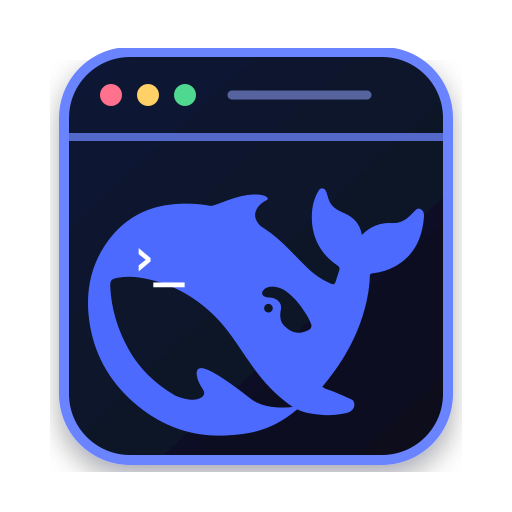
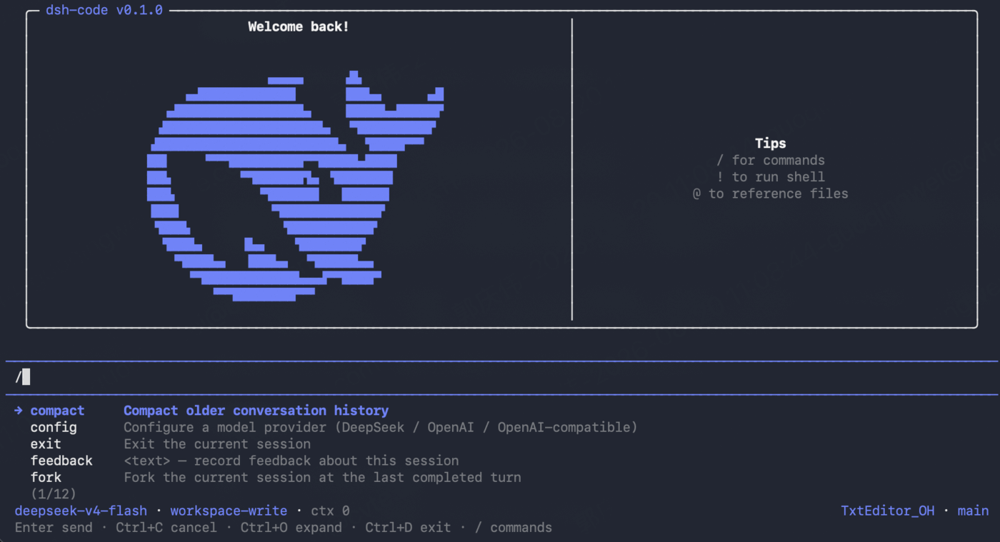
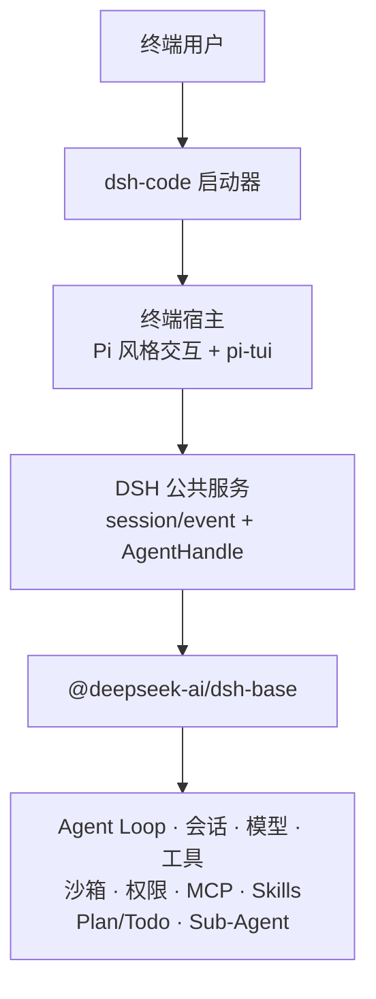

<p align="center">
  
</p>

<h1 align="center">dsh-code</h1>

<p align="center">
  面向偏好 TUI 工作流开发者的 DeepSeek Harness 终端编程 Agent。
</p>

<p align="center">
  <a href="README.md">English</a> · <strong>简体中文</strong>
</p>

<p align="center">
  <a href="https://github.com/guoxiucai/dsh-code/actions/workflows/ci.yml"></a>
  <a href="LICENSE"></a>
  
  <a href="https://github.com/deepseek-ai/deepseek-harness"></a>
</p>

> [!IMPORTANT]
> `dsh-code` 是独立的社区项目，目前正在准备首次公开发布，并非 DeepSeek
> 官方发行版。DeepSeek Harness 本身也处于开发者预览阶段，在升级固定基线时
> 可能出现不兼容变更。

## 为什么有 dsh-code？

[DeepSeek Harness](https://github.com/deepseek-ai/deepseek-harness) 已提供官方
Web UI 和插件优先的 Agent Runtime。`dsh-code` 面向更习惯留在终端中的开发者：
它将同一套 DSH Agent 语义封装成紧凑的键盘驱动界面，适合与 Shell、编辑器、
Git 和远程开发环境配合使用。

产品借鉴了 [Pi](https://github.com/earendil-works/pi) 的终端交互思想，并使用
[`@earendil-works/pi-tui`](https://www.npmjs.com/package/@earendil-works/pi-tui)
完成终端渲染，但**没有**复制或替换 Agent 核心。Agent Loop、会话、模型适配器、
工具、沙箱、权限、MCP、Skills、Plan/Todo 和 Sub-Agent 仍由固定版本的 DSH Runtime
负责。

简而言之：

```text
DeepSeek Harness Agent Runtime + Pi 风格终端交互 + pi-tui 渲染器
```

## 功能展示

<p align="center">
  
</p>

## 功能亮点

- **终端原生工作流**：流式 Markdown、思考过程、工具卡片、文件 Diff、可折叠输出、
  Shell 结果块和固定在底部的输入区域。
- **复用 DeepSeek Harness 语义**：只使用 DSH 的公共 Session/Event 和服务接口，
  不维护第二套 Agent Loop、会话存储、权限引擎或工具注册表。
- **TUI 内完成模型配置**：通过可回退的内联向导配置 DeepSeek、OpenAI 或
  OpenAI-compatible 服务。
- **安全的项目启动流程**：按规范化绝对路径记录信任状态，支持 `read-only`、
  `workspace-write`、`danger-full-access` 三种权限预设。
- **持久化会话**：继续最近会话，搜索/恢复/删除历史会话，查看会话统计，
  从已完成轮次 Fork，以及压缩上下文。
- **清晰的 Agent 状态**：独立的 Plan/Todo 状态、工具进度、重试与压缩提示、
  操作授权以及 Sub-Agent 活动。
- **高效终端操作**：`/` 命令补全、`@` 文件补全、`!` Shell 模式、内联选择器和
  键盘导航。
- **独立安装与数据目录**：数据保存在 `~/.dsh-code`，不会覆盖单独安装的 `dsh`，
  并提供显式更新命令。
- **自适应视觉主题**：DeepSeek 蓝主题分别针对暗色和亮色终端背景优化。

## 架构说明

`dsh-code` 有意保持为固定 DSH 基线之上的轻量终端宿主：



启动器只负责产品层能力：命令解析、`~/.dsh-code` 数据隔离、项目信任、会话选择、
Profile 初始化、产品更新，以及委托上游 DSH 启动。TUI 只渲染结构化事件，并通过
公共 `AgentHandle` API 把用户输入送回 Agent。

架构约束见 [`docs/adr/`](docs/adr/)，固定的上游版本见
[`UPSTREAM_BASELINE.md`](UPSTREAM_BASELINE.md)。

## 环境要求

| 组件 | 首个版本支持范围 |
| --- | --- |
| macOS | macOS 14 或更高，Apple Silicon (`arm64`) |
| Windows | Windows 10 或更高，x64 |
| Node.js | `22.19+`（不含 Node 23）或 `24+` |
| 包管理器 | 普通安装只需要 npm |

首个版本暂不支持 Linux、macOS Intel/Rosetta、Windows ARM，以及不安装 Node.js 的
独立可执行文件分发方式。

## 安装

### npm 安装

首次公开版本发布后执行：

```bash
npm install -g @tsingwill/dsh-code
```

验证安装结果：

```bash
dsh-code --version
dsh-code --help
```

npm 包名是 `@tsingwill/dsh-code`，安装后的终端命令仍是简短的 `dsh-code`。

### 从源码构建

```bash
git clone --recurse-submodules https://github.com/guoxiucai/dsh-code.git
cd dsh-code
corepack enable
corepack prepare pnpm@11.7.0 --activate
pnpm install --frozen-lockfile
pnpm run build:lib
pnpm run build
node lib/bin.js
```

## 快速开始

```bash
cd /path/to/your/project
dsh-code
```

首次在某个项目中启动时：

1. 核对规范化后的项目路径并选择权限预设；
2. 输入 `/config`，选择模型服务商；
3. 完成内联配置，然后在输入框中发送任务。

选择 DeepSeek 官方 API 时，`/config` 会要求填写 API Key 并选择默认模型。
选择 OpenAI-compatible 服务时，向导会明确配置五项内容：

1. Provider Route ID；
2. Base URL；
3. Credential 环境变量名（根据 Route ID 自动预填）；
4. API Key；
5. Model ID。

向导中的示例以 DeepSeek-compatible 服务为准；按 `Esc` 可以回到上一步，只有最后
一步成功后才会写入配置。Credential 以仅当前用户可读的权限保存在
`~/.dsh-code/.credentials.yaml`。

## 使用说明

### 命令行

| 命令 | 说明 |
| --- | --- |
| `dsh-code` | 启动新的交互式 TUI 会话 |
| `dsh-code -c`、`--continue` | 继续当前项目最近一次会话 |
| `dsh-code -r`、`--resume` | 打开可搜索的会话选择器 |
| `dsh-code resume [session-id]` | 选择或指定会话进行恢复 |
| `dsh-code -p "<任务>"` | 以 Headless 模式执行一次任务并输出最终答案 |
| `dsh-code -p "<任务>" --approve` | 非交互信任项目，使用 `workspace-write` 权限 |
| `dsh-code plugin <命令>` | 委托 DSH 管理 Profile 插件（需要 pnpm） |
| `dsh-code update --check` | 检查 npm stable 渠道是否有更新 |
| `dsh-code update` | 确认并安装可用更新 |
| `dsh-code update --channel next` | 切换到 RC 更新渠道 |

### TUI 内置命令

| 命令 | 说明 |
| --- | --- |
| `/config` | 配置 DeepSeek、OpenAI 或 OpenAI-compatible 服务 |
| `/model` | 使用内联选择器切换当前模型 |
| `/permission` | 选择当前权限预设 |
| `/mcp add` | 为当前项目添加 stdio 或 Streamable HTTP MCP Server |
| `/mcp remove <name>` | 移除项目 MCP Server |
| `/session` | 查看会话、消息、工具、模型与 Token 统计 |
| `/fork` | 从最近一个已完成轮次创建分支会话 |
| `/compact` | 通过 DSH 压缩当前上下文 |
| `/quit`、`/exit` | Agent 空闲时退出 |
| `!<命令>` | 直接执行 Shell/PowerShell 命令，不发送给模型 |

固定 DSH Profile 提供的其他命令可以通过 `/` 自动补全发现。

### 常用按键

| 按键 | 操作 |
| --- | --- |
| `Enter` | 发送内容或确认内联选择 |
| `Esc` | 返回/取消当前内联选择器或向导步骤 |
| `Ctrl+C` | 取消正在执行的轮次；空闲时按上下文清空或退出 |
| `Ctrl+O` | 展开或折叠思考过程与工具输出 |
| `Ctrl+D` | Agent 空闲时退出 |
| `/` | 打开命令补全 |
| `@` | 补全项目文件；安装 `fd` 后启用更快的模糊查找 |

## 会话、配置与数据隔离

默认情况下，dsh-code 的全部状态都保存在 `~/.dsh-code`：

```text
~/.dsh-code/
├── .credentials.yaml       # 仅当前用户可读的服务商 Credential
├── profiles/dsh-code/      # 固定 DSH Profile 与终端宿主 Patch
├── projects/               # 按规范化路径保存的项目信任记录
└── sessions/               # 按项目分组的持久化会话
```

通过 `DSH_CODE_HOME` 可以修改根目录。启动时 dsh-code 会把委托进程的 `DSH_HOME`
指向这个独立目录，并禁用 DSH Telemetry；它不会读取或覆盖 `~/.dsh`，全局安装的
上游 `dsh` 命令也保持独立。

项目 MCP 配置写入可信项目内的 `.dsh-code/cordis.patch.yml`，下次启动后生效。

## 更新

dsh-code 只执行用户明确发起的更新，不会静默升级：

```bash
dsh-code update --check
dsh-code update
dsh-code update --channel next
dsh-code update --version 0.1.0-rc.1
```

更新命令仅适用于 npm 全局安装。源码检出版本应继续通过 Git 和原构建工具升级。

## 开发与验证

```bash
pnpm run typecheck
pnpm test
pnpm run build
```

仓库通过 `deepseek-harness/` Git Submodule 固定 DeepSeek Harness 版本。产品代码位于
仓库根目录；上游变更应单独升级固定基线，或者优先贡献给 DSH。

发布设计、macOS/Windows 编译、候选包验证和更新方案见
[`docs/NPM_RELEASE.md`](docs/NPM_RELEASE.md)。

## 贡献与安全

- 提交 Pull Request 前请阅读 [`CONTRIBUTING.md`](CONTRIBUTING.md)；
- 使用 [GitHub Issues](https://github.com/guoxiucai/dsh-code/issues) 公开反馈问题和建议；
- 安全漏洞请按照 [`SECURITY.md`](SECURITY.md) 私密报告；
- 不要上传未脱敏的 API Key、会话日志、Credential 或 Crash Log。

## 项目关系与致谢

`dsh-code` 是独立的下游社区项目，与 DeepSeek AI 或 Pi 维护者不存在隶属或官方背书关系。

- Agent Runtime：[DeepSeek Harness](https://github.com/deepseek-ai/deepseek-harness)
- TUI 渲染与交互思想：[Pi](https://github.com/earendil-works/pi)
- 产品封装、分发和终端宿主：本仓库

dsh-code 终端小鲸鱼 Logo 将 DeepSeek 官方鲸鱼轮廓与终端窗口、提示符组合在一起。
DeepSeek 名称和官方鲸鱼图形归其各自权利人所有，完整归属说明见 [`NOTICE`](NOTICE)。

## 许可证

[MIT](LICENSE) © 2026 guoxiucai。第三方许可证说明见
[`THIRD_PARTY_NOTICES.md`](THIRD_PARTY_NOTICES.md)。
