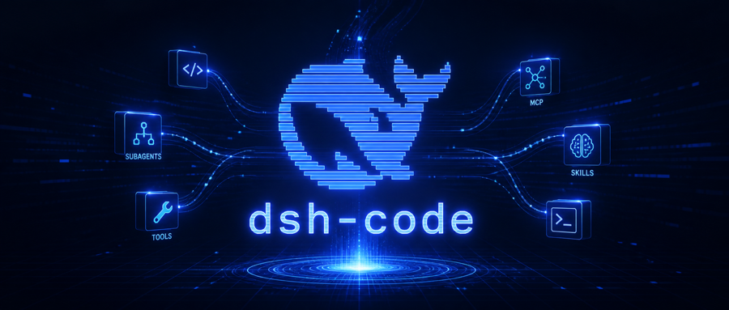

# 把 Code Agent 掌握在自己手里：dsh-code 0.1.1-rc.1 发布



AI 编程工具越来越强，但极客真正想要的，不只是一个“替你写代码”的黑盒，而是一个自己能够控制、组合，并持续进化的 Code Agent。

这正是 dsh-code 的出发点。

dsh-code 是基于 DeepSeek Harness 的开源终端编程 Agent。它不另造 Agent Loop，而是把 DSH 的会话、模型、工具、权限、MCP、Skills 和 Sub-Agent 能力，装进键盘优先的 TUI。你可以选择模型、接入自己的 MCP 和 Skills、控制项目权限，也可以让多个 Sub-Agent 并行执行任务。

0.1.1-rc.1 重点完善了真实长会话体验：历史渲染改为增量缓存；大段粘贴会显示主题色标记；`@` 支持文件与文件夹模糊联想；Agent 工作时继续输入会明确提示消息排队；长工具输出默认折叠为 5 个视觉行，但文件修改 Diff 始终完整展示。

Sub-Agent 也变得真正“可见、可控”：任务启动即显示状态，点击即可查看内联列表，并支持取消或移除；任务结束后结果自动回到主会话。

## 建议演示画面

> 【演示图 1：首次启动、项目权限选择与模型配置】

> 【演示图 2：`@` 文件夹联想、大段粘贴标记与消息排队】

> 【演示图 3：完整文件 Diff 与默认折叠的长工具输出】

> 【演示图 4：Sub-Agent 运行指示、内联列表和取消操作】

> 【演示图 5：MCP 热连接、Skills 管理与 Plan/Todo】

当前支持 macOS Apple Silicon 和 Windows x64，需要 Node.js 22.19+ 或 24+。体验候选版本：

```bash
npm install -g @tsingwill/dsh-code@next
dsh-code
```

如果你希望 Code Agent 不只是定义好的产品，而是一套自己拥有、组合和进化的工作环境，欢迎试用 dsh-code。

项目地址：https://github.com/guoxiucai/dsh-code
