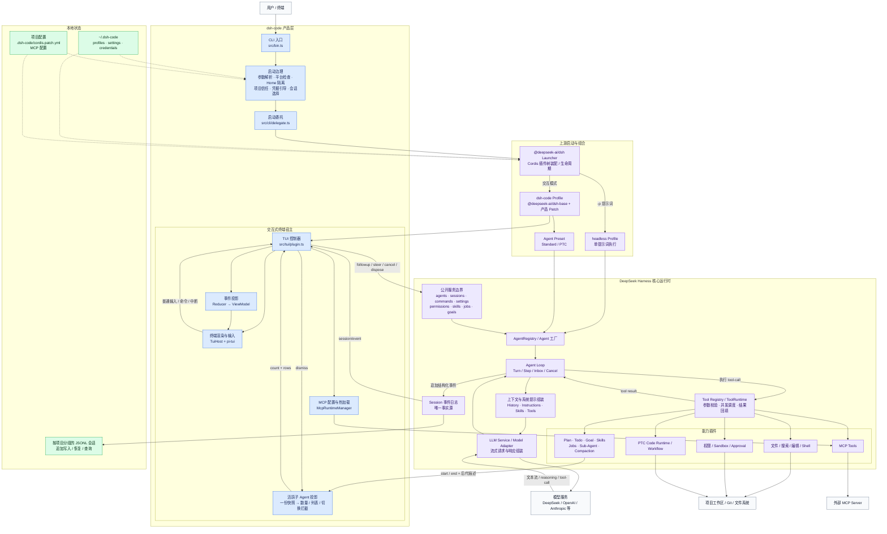

# dsh-code 整体架构

本文基于 CodeGraph 对当前仓库的索引结果绘制。图中蓝色部分是 `dsh-code`
自身负责的产品层，紫色部分来自固定版本的 DeepSeek Harness；两者通过公开的
Cordis 服务、`AgentHandle` 和 `session/event` 边界协作。

## 关键调用链

1. `src/bin.ts` 只处理产品级职责：命令行参数、平台检查、独立 Home、项目
   信任、Profile 初始化和会话选择；随后由 `src/cli/delegate.ts` 启动上游
   `@deepseek-ai/dsh`。
2. 交互模式加载 `dsh-code` Profile。该 Profile 以 `dsh-base` 为基础，挂载
   Standard/PTC Preset、PTC Worker Runtime、兼容 Skills、Ask User 和 TUI 插件。
   `-p` 模式则直接使用上游 `headless` Profile。
3. `src/tui/plugin.ts` 创建或恢复 Agent，通过公开 `AgentHandle` 发送输入，不
   导入 Agent Loop 内部实现。`TuiHost` 负责终端输入输出，Reducer 把结构化
   `session/event` 投影成可渲染状态。
4. Agent Loop 以 Turn/Step 驱动：组装历史、系统提示、Skills 和工具 Schema，
   调用模型适配器；若模型返回 Tool Call，则交给 Tool Runtime 执行并把结果
   加回下一 Step，直到本轮完成。
5. Session 是运行状态的唯一事实源。事件一边推送给 TUI，一边由上游持久化
   服务追加到项目分组的 JSONL 日志，因此恢复、会话树、统计和导出都基于同一
   份事件历史。
6. `src/tui/active-subagent-projection.ts` 把子 Agent 的 `start/end` 生命周期、
   稍晚到达的后代描述和界面隐藏操作合成一份快照。状态栏数量、`/agents`
   列表与会话切换拦截只读这份快照，避免各处分别计算后出现短暂不一致。

## 代码边界

| 层次 | 主要位置 | 责任 |
| --- | --- | --- |
| 产品入口 | `src/bin.ts`, `src/bootstrap/`, `src/cli/` | 启动治理、信任、配置、委托 |
| 终端产品层 | `src/tui/` | TUI、事件投影、交互命令、MCP 管理 |
| 上游核心 | `deepseek-harness/packages/core/` | Agent、Agent Loop、Session、Tools |
| 模型层 | `deepseek-harness/packages/llm/` | 模型目录、适配器、流式响应、Token 统计 |
| 能力层 | `deepseek-harness/packages/{mcp,skill,shell,sandbox,plan,goal,jobs,subagent}/` | 可组合能力插件 |
| 持久化层 | `deepseek-harness/packages/session/` | Session JSONL、恢复、查询与投影 |

这条边界的核心约束是：`dsh-code` 是薄终端宿主，不维护第二套 Agent Loop、
Session Store、Permission Engine 或 Tool Registry。
