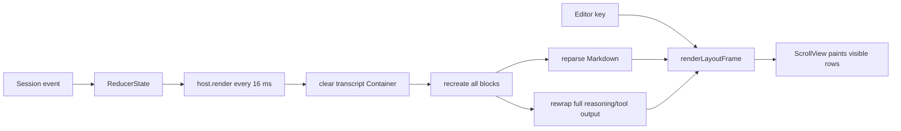
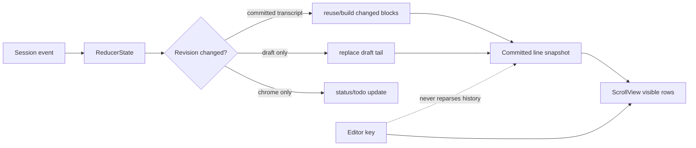

# TUI 长会话性能优化方案

- **状态：** Implemented
- **日期：** 2026-08-22
- **实施完成：** 2026-08-23
- **样本：** OHBM 项目当前最长会话
- **决策记录：** [ADR-0003](../adr/0003-incremental-cached-transcript-rendering.md)
- **领域词汇：** [TUI Rendering Glossary](../glossary/tui-rendering.md)

## 结论

卡顿的主要原因不是终端输出速度，也不是 Session 文件压缩，而是 TUI 主线程在每个输入帧和流式刷新帧重复处理完整历史：

1. 折叠的 reasoning 仍从头执行换行计算；
2. `host.render()` 每次清空并重建全部消息组件，使 Markdown 缓存失效；
3. `ScrollView` 裁剪了最终绘制，却仍要求完整 transcript 参与布局；
4. 每个 16 ms 刷新 tick 还会重新调用 `tokenMeter.measure()`；
5. Editor 自身只在约 50k 可见字符时成为独立瓶颈，当前不应优先重写。

推荐分两级处理：先实现本地的增量 transcript surface 和稳定行快照缓存，把输入帧与历史长度解耦；如果百万行级会话仍不达标，再给 pi-tui 增加真正的虚拟行源接口。只做节流、降低帧率或截断历史都不能解决输入卡顿。

## 可重复证据

反馈环：

```bash
pnpm exec tsx scripts/bench-tui-long-session.mts <session.jsonl.zstd>
```

脚本通过生产 reducer 重放真实 Session，再驱动生产 `TuiHost` 和 pi-tui layout。它只输出事件数、字符数和耗时，不输出会话正文。当前脚本在超过 16.7 ms 帧预算时以退出码 1 返回。

OHBM 样本统计：

| 指标 | 数值 |
| --- | ---: |
| 压缩 Session | 596,890 bytes |
| 解压 Session | 1,563,619 bytes |
| 逻辑事件 | 36,643 |
| 可见 transcript 项 | 149 |
| transcript 字符 | 284,871 |
| reasoning 字符 | 69,092 |
| tool result 字符 | 162,072 |

在 120×40 视口下的本机 P95：

| 场景 | P95 | 相对 16.7 ms 预算 |
| --- | ---: | ---: |
| 完整历史稳态帧 | 76.09 ms | 4.6× |
| 完整历史重建 + 布局 | 99.90 ms | 6.0× |
| 移除 reasoning 后稳态帧 | 29.45 ms | 1.8× |
| 移除 reasoning 后重建 + 布局 | 50.15 ms | 3.0× |
| 仅最近 10 项重建 + 布局 | 15.31 ms | 0.9× |
| 独立 Editor，10k 字符 | 5.30 ms | 0.3× |
| 独立 Editor，50k 字符 | 25.52 ms | 1.5× |

以上结果证明至少有三个叠加的线性成本：折叠内容处理、组件重建和完整历史布局。OHBM 的卡顿已经可以自动复现，不再依赖主观体感。

## 实施结果

2026-08-23 按本方案完成增量 `TranscriptSurface`、稳定宽度行缓存、折叠 tool output 优化、30 FPS stream 合并，以及 `assistant/chunk` token 测量去热路径。同一 OHBM 样本复测：

| 场景 | 优化前 P95 | 优化后 P95 |
| --- | ---: | ---: |
| 完整历史稳态帧 | 76.09 ms | 0.13 ms |
| 冗余完整 view 更新 + 布局 | 99.90 ms | 0.11 ms |
| 完整历史 + 10k 输入 | 80.59 ms | 5.12 ms |
| stream draft + 完整历史 | — | 3.91 ms |
| 替换一个尾部 item | — | 1.34 ms |
| 首次完整历史布局 | — | 60.54 ms |

10× OHBM 合成历史（1,490 项）也通过增长余量验证：10k 输入 P95 5.33 ms，stream draft P95 1.57 ms。原始反馈环由 RED 转为 GREEN，PR 4 的 pi-tui 虚拟行接口因此暂不需要。

## 设计拷问记录（grilling）

以下问题决定方案边界。用户尚未另行指定时采用“默认裁决”。

### 我们优化的到底是什么？

不是“平均 render 更快”，而是用户按键到新光标帧的 P95，以及流式 chunk 到可见帧的 P95。长会话中最重要的不变量是：输入操作不能触发已提交历史的重新解析或重新换行。

### 可以通过截断历史换性能吗？

默认裁决：不可以。完整历史必须继续支持滚动、搜索、选择和复制。显示缓存可以丢弃并重建，但 Session 数据和 transcript 投影不得丢失。

### 输入和流式动画冲突时谁优先？

默认裁决：输入优先。按键、光标和滚动是 interactive lane；assistant chunk 是 stream lane，可合并为 30 FPS；计时器和 token 状态是 ambient lane，可低频更新。

### 流式 Markdown 必须逐 token 完整排版吗？

默认裁决：完成态必须精确；流式态允许合并相邻 chunk，但不默认降级为纯文本。若单条 draft 超过保护阈值，可只预览尾部并在完成时一次性生成完整 Markdown，这需要单独的产品确认。

### 可以用内存换延迟吗？

默认裁决：可以，但缓存只保留当前终端宽度、主题 revision 和展开模式的派生行。resize 或主题变化时丢弃旧行，不建立无界的多宽度缓存。

### 是否要换掉 pi-tui 或改 Session 层？

默认裁决：第一阶段都不需要。问题位于 dsh-code 的 presentation hot path，本地 `Component` 可以返回稳定的行快照；这符合“薄 Terminal Host”约束。只有真正需要按需读取虚拟行时才向 pi-tui 提交通用接口。

### 50k 输入怎么处理？

pi-tui 已把超过 1,000 字符或 10 行的 bracketed paste 折叠为原子 paste marker，因此常见的大段粘贴不会形成 50k 可见 Editor 文本。第一阶段不重写 Editor；保留 50k 场景作为保护性基准。

## 根因与数据流



`ScrollView` 的裁剪发生得太晚：为了得到 content height，它先调用完整 transcript 的 `render(width)`。即使屏幕只绘制 40 行，历史组件和行数组仍在主线程上被遍历。

另一个热路径位于 plugin：`scheduleRender()` 每次执行 `tokenMeter.measure(agent.session)`。TokenMeter 对事件折叠是增量的，但公开 `measure()` 会克隆和冻结整个 token surface；状态栏不需要按 chunk 更新。

## 目标架构



核心组件为 `TranscriptSurface`：

- 保留已提交 `TranscriptItem` 到稳定 block 的映射；
- 以 `width + themeRevision + expansionMode` 为缓存键，只保留当前行快照；
- `render(width)` 在缓存有效时直接返回同一个 `string[]`；
- draft 是可替换尾部，不使 committed prefix 失效；
- transcript 新数组出现时先做最长公共前缀比较，只构建新增或被替换的 item；
- resize、主题切换和全局展开是显式失效点。

这不是丢弃历史。它把完整历史从“每帧重新计算的数据”变成“事件变化时更新的派生索引”。

## 分阶段实施

### PR 1：建立性能反馈环和结构性门禁（完成）

1. 保留当前真实会话 benchmark，用于本地诊断。
2. 在 benchmark 中增加 10× transcript 增长场景，只输出聚合数据而不输出正文。
3. 增加结构性测试：
   - 一个按键帧不得调用 committed Markdown render；
   - 一个 `assistant/chunk` 不得重建历史 block；
   - committed reasoning 的宽度结果必须复用，collapsed tool result 不得先分配全部行。

共享 CI 机器上的墙钟基准容易抖动，因此 CI 以调用次数和失效范围为硬门禁；墙钟 SLO 在固定 runner 或发布前 benchmark 执行。

### PR 2：消除已提交历史的重复计算（完成）

1. 引入 `TranscriptSurface`，替代每次 `transcriptContainer.clear()` 后全量重建。
2. 对 block 增加当前宽度的行缓存；`ReasoningBlock` 和 `ToolCard` 不能继续无缓存 render。
3. collapsed reasoning 只消费已缓存的尾部 5 个视觉行。
4. collapsed tool result 用反向查找最后 5 个换行符，禁止先 `split()` 全文。
5. diff 的计算和 tool argument JSON 解析绑定到稳定 item，只执行一次。

原方案还考虑把 running subagent 数量移入 reducer；实测增量 surface 完成后该过滤不再是超预算项，因此没有扩大 reducer 的持久投影职责。

验收：OHBM 样本在空输入和 10k 输入时的 interactive frame P95 均小于 16.7 ms；输入帧的 committed block render count 为零。

### PR 3：拆分刷新 lane（完成）

1. interactive lane：按键、光标、scroll、selection，立即请求帧。
2. stream lane：assistant chunk 合并到最多 30 FPS；输入事件可以抢占等待中的 stream tick。
3. ambient lane：working duration 每秒；token context 只在 model-visible surface 变化或低频状态刷新时测量。
4. `host.render(view)` 拆成语义更明确的更新：committed transcript、draft tail、chrome/status。调用方不再用一个全量入口表达所有变化。

验收：持续流式输出时，输入 P95 仍小于 16.7 ms；stream frame P95 小于 33.3 ms；不会丢失最后一个 chunk 或完成态消息。

### PR 4：按结果决定是否引入真正虚拟化（当前不需要）

先用缓存行快照验证 10× OHBM 合成会话。如果仍不达标，再扩展 pi-tui：

- `VirtualLineSource.length(width)`；
- `VirtualLineSource.slice(width, start, end)`；
- ScrollView 基于可见范围请求行；
- 搜索显式扫描 line source，而不是要求每帧构造完整数组。

这是通用 renderer 能力，应优先贡献到 pi-tui，而不是在 dsh-code 内复制 ScrollView、selection 和 search 语义。

## 性能 SLO

| 场景 | 目标 |
| --- | ---: |
| OHBM 规模，普通按键到 frame P95 | ≤ 16.7 ms |
| OHBM 规模，10k 可见输入按键 P95 | ≤ 16.7 ms |
| OHBM 规模，stream frame P95 | ≤ 33.3 ms |
| 10× OHBM，普通按键 P95 | ≤ 33.3 ms |
| resize 后首次完整重排 | ≤ 250 ms |
| cached steady frame 对历史字符数的复杂度 | O(viewport + input) |
| assistant chunk 对已提交历史的工作量 | O(1) |

SLO 测量不包含首次 Session 解压和 reducer replay；它们属于 resume latency，应单独记录。

## 正确性与回归测试

- 完整滚动、搜索、选择和复制与优化前一致；
- 手动离开底部后，新 chunk 不强制跳回底部；
- 回到底部后继续 follow-end；
- CJK、ANSI、emoji、超长单行、Markdown code fence 和 diff 背景保持正确；
- Ctrl+O、resize、暗亮主题切换会正确失效缓存；
- tool running → done/error 只替换目标 block；
- draft → committed 不重复显示，也不丢尾部；
- cache 只保存派生显示数据，不改变 Session 或 reducer 语义；
- 停止/退出仍走 ADR-001 的 dispose 路径。

## 发布与回滚

本次没有保留双 renderer 运行时开关：新增结构性测试已经锁定 committed block 复用、draft 隔离和稳定行快照，10× OHBM 也通过性能预算。若发布后出现终端兼容性问题，使用版本回退；避免长期维护未被日常测试覆盖的 legacy 渲染分支。benchmark 只输出聚合尺寸和时间，不写会话正文、tool 参数或用户输入。

## 不推荐的方案

- **只把 16 ms 改为 50/100 ms：** 能减少生成时刷新次数，不能改善按键触发的完整布局。
- **只升级硬件或 Node：** 当前路径存在明确的 O(history) 工作，规模继续增长后仍会复现。
- **截断 transcript：** 破坏历史搜索、选择和滚动，不符合产品语义。
- **先重写 Editor：** OHBM 下 10k Editor 独立 P95 只有 5.30 ms，收益顺序错误。
- **切回 main screen：** 当前产品实际使用 `TuiAltScreen` 以固定底部交互区；更换 screen 模式不会自动消除组件重建和全文换行。
- **复制一套 Session 投影：** 违反 ADR-001；所有优化必须停留在可丢弃的显示缓存层。

## 尚需产品确认的问题

这些问题不阻塞 PR 1–2，但会影响极端场景策略：

1. 超过 20k 的单条流式 assistant draft，是否允许暂时显示尾部预览并在完成后恢复完整 Markdown？
2. Ctrl+O 是否继续“一次展开全部历史”，还是改为只展开当前/选中 block？
3. 10× OHBM 的目标是保持 30 FPS，还是要求与 OHBM 同样达到 60 FPS？
