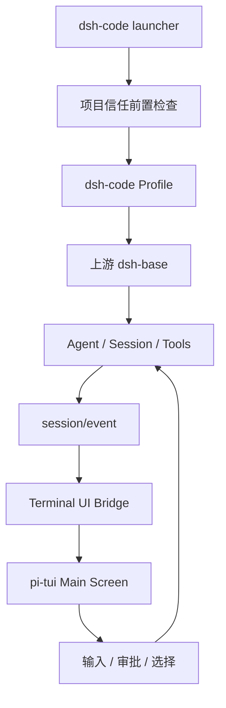
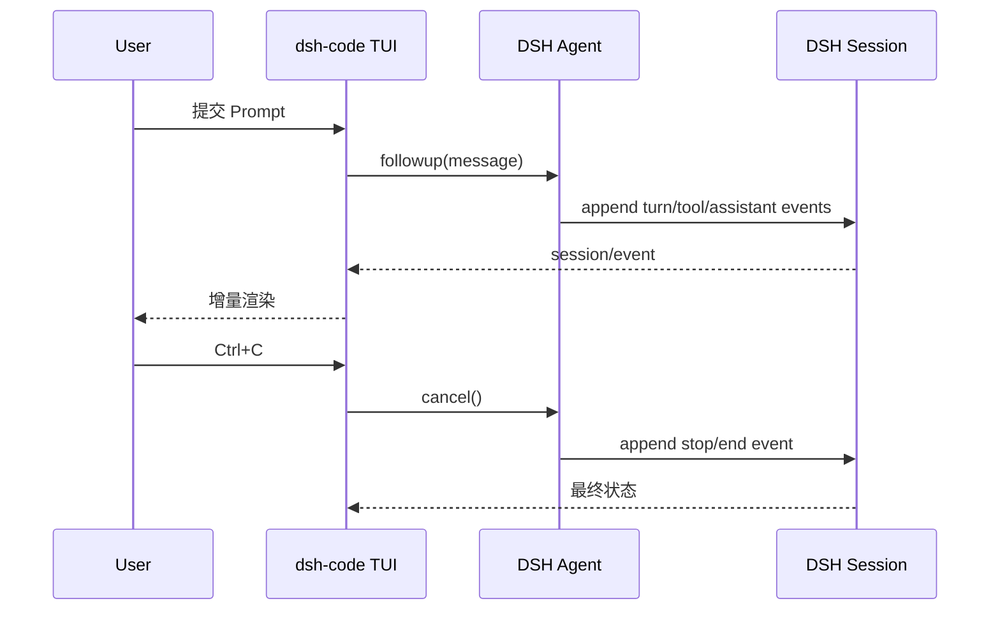
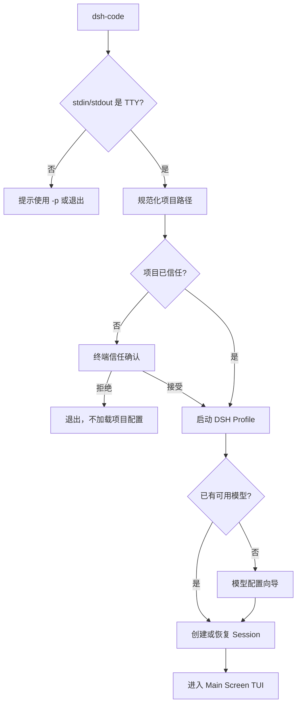
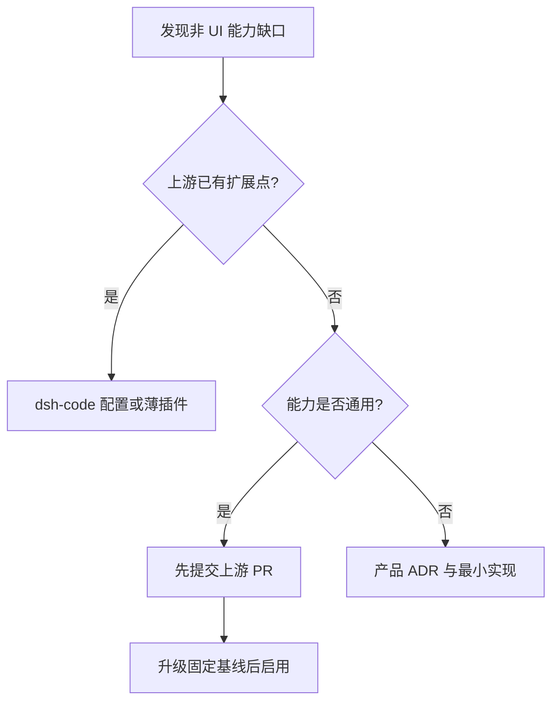

# dsh-code V1 技术实现详细方案

> 文档状态：评审基线（Implementation Ready）
> 编写日期：2026-08-15
> 目标读者：架构评审 Agent、分阶段实施 Agent、代码审查者、发布负责人
> 上游项目：[deepseek-ai/deepseek-harness](https://github.com/deepseek-ai/deepseek-harness)
> 产品名称：`dsh-code`
> 许可证：MIT

---

## 1. 文档目的

本文档定义 `dsh-code` V1 的最终技术实现方案、架构边界、目录设计、运行流程、分阶段实施任务、测试用例和发布验收规则。

本文档可以直接作为：

1. 架构评审输入；
2. 实施 Agent 的任务分解依据；
3. 每个阶段 PR 的 Definition of Done；
4. V1 发布前的验收清单。

如果实施过程中的临时设计与本文档冲突，应先修改本文档或新增 ADR，不能通过代码事实悄悄改变架构。

---

## 2. 最终产品定义

`dsh-code` 是 DeepSeek Harness 的公开下游产品，定位为：

> `@deepseek-ai/dsh-base` 的 Terminal Host 和独立 npm 产品封装。

它不是新的 Agent 内核，不重新实现 DSH 已经提供的 Agent Loop、Session、模型适配、工具、Sandbox、权限、MCP、Skills、Plan/Todo 或子 Agent。

用户安装后，可以在任意项目目录中运行：

```bash
npm install -g @tsingwill/dsh-code
cd /path/to/project
dsh-code
```

默认进入纯终端交互式 TUI。TUI 使用 `@earendil-works/pi-tui` 的 `TuiMainScreen`，保留终端主缓冲区和 scrollback，不启动 Web Server，不打开浏览器，不使用 Electron。

### 2.1 最高优先级原则

以下原则按优先级排序：

1. **非 UI 行为以上游 DSH 为准。**
2. **不复制或分叉上游 Agent 语义。**
3. **尽量通过新增 app/profile/plugin 实现，不修改上游包。**
4. **缺失的通用非 UI 能力应先贡献到上游。**
5. **产品差异集中在终端呈现、启动封装、项目信任和 npm 发行。**
6. **安全能力必须按上游真实语义描述，不能扩大承诺。**

### 2.2 架构不变量

下列规则是代码审查时的硬性不变量：

- TUI 只能通过 DSH 公开服务、公开事件和 Agent Handle 操作 Agent。
- 不得直接导入 `agent-loop` 内部实现。
- 不得建立第二套 Session Store、Provider Store、Permission Engine 或 Tool Registry。
- 不得在 TUI 中根据文本猜测工具状态；必须消费结构化 Session 事件。
- 相同 DSH 配置和相同模型响应下，TUI 与 headless 路径的核心 Session 语义必须等价。
- `dsh-code` 退出时必须调用上游 flush/dispose 路径，不得直接终止而丢失会话。
- 项目配置未获得信任前，不得加载项目级插件、MCP、Skills 或 `.dsh-code` patch。

---

## 3. 已确认的 V1 范围

### 3.1 支持平台

| 平台 | 架构 | V1 状态 |
| --- | --- | --- |
| macOS | arm64 | 必须支持 |
| macOS | x64 | 必须支持 |
| Linux | glibc x64 | 必须支持 |
| Linux | glibc arm64 | 必须支持 |
| Windows 原生 | x64 | 必须支持 |

不把 WSL 作为 Windows 原生支持的替代品。

### 3.2 Node.js 前置条件

跟随固定上游基线的 `engines.node`。本文编写时，上游要求：

```text
^22.19.0 || >=24.0.0
```

`pi-tui` 当前也要求 Node.js `>=22.19.0`。产品不得自行降低 Node.js 下限。

### 3.3 模型与凭证

V1 开箱即用支持：

- DeepSeek；
- OpenAI；
- 用户声明能力的任意 OpenAI-compatible 服务。

规则：

- 纯本地 CLI；
- 用户自备 API Key；
- 首次启动使用 TUI 向导配置；
- 环境变量优先于本地凭证文件；
- API Key 不加密，使用上游凭证机制保存在 `~/.dsh-code`；
- POSIX 上凭证文件权限应收紧为仅当前用户可读写；
- Windows 使用当前用户 ACL，不额外引入原生密钥 helper；
- OpenAI-compatible 服务的能力完全使用用户声明，不主动探测；
- 不在启动时自动调用 `/models`；如未来提供“获取模型列表”，必须由用户显式触发。

### 3.4 V1 功能

- 交互式 TUI；
- 单次 Prompt 后退出；
- 会话持久化；
- 历史会话选择与恢复；
- 会话 Fork 和父子谱系展示；
- Skills 与项目指令；
- MCP 服务接入；
- 上游子 Agent 能力和并发状态展示；
- Plan/Todo 展示与交互；
- Shell 流式输出、超时与取消；
- 权限档位选择；
- 项目首次信任；
- Host 插件安装和管理；
- 显式 `dsh-code update`；
- npm 独立构建和发布；
- 上游配置一次性导入。

### 3.5 明确不包含

- Web UI；
- 浏览器服务；
- Electron 或桌面应用；
- JSON/JSONL 用户输出协议；
- 启动时更新检查；
- 默认遥测；
- 长驻 PTY；
- dsh-code 私有 Agent Loop；
- dsh-code 私有 Session 格式；
- 新增原生 Sandbox helper；
- 工作区外读取隔离承诺；
- 自动 worktree 子 Agent 编排；
- 本地 MCP 自动继承 Agent Sandbox；
- Plan 模式底层硬禁止写入；
- 上一个问题中的撒花插件示例。

---

## 4. 与早期需求冲突时的最终裁决

最终的“薄 TUI”原则会覆盖部分早期设想。评审 Agent 应检查实现是否遵守以下裁决。

| 早期设想 | V1 最终裁决 | 原因 |
| --- | --- | --- |
| 每个子 Agent 自动创建 Git worktree | 不在 dsh-code 私有实现；使用上游 provider 语义 | 上游当前 ACP 子 Agent 默认继承父 Session cwd，没有 worktree 语义 |
| 非 Git 项目复制并生成补丁 | 不在 V1 实现 | 属于新的子 Agent 编排内核 |
| 本地 MCP 继承项目 Sandbox | 不作此承诺；明确提示其为宿主可信进程 | 上游 stdio MCP 在 Agent Sandbox 外运行 |
| Plan 模式强制禁止写入 | 不作此承诺；按上游软指导展示 | 上游 Plan 与 Sandbox/Approval 独立 |
| 工作区外目录长期读写授权 | 不实现；使用上游一次性提权重试 | 上游 Sandbox 不限制读取，写入提升按每次调用处理 |
| 自建插件运行时和锁协议 | 不实现；委托上游 Profile/Bundle/Plugin | 避免分叉依赖和加载语义 |
| 项目级插件完全独立运行时 | 使用上游派生 Profile 表达作用域 | 复用上游组合机制 |
| `npm` 更新全部插件 | 产品自身使用 npm；插件更新委托上游 Profile 的 pnpm 管理 | 上游插件管理器明确以 pnpm 作为执行后端 |

如业务仍要求前三项更强语义，应先向 DSH 上游提交通用 PR，再在新的上游基线上启用；不得先在 dsh-code 中形成永久私有实现。

---

## 5. 上游依据与设计结论

### 5.1 Profile 和 Bundle

上游把运行中的 DSH 定义为按顺序叠加的插件层。`dsh-base` 是每个 Profile 的第一层，包含模型适配、工具、持久化、Sandbox、审批、设置和凭证等基础能力。`headless` 是直接叠加在 `dsh-base` 上的一次性运行器。

因此 dsh-code 应实现为：

```text
dsh-base + dsh-code terminal profile patch
```

而不是复制 `dsh-base` 中的插件集合。

### 5.2 UI 接入方式

上游 Extension Cookbook 明确要求：

- UI 从 `session/event` 渲染；
- assistant token 流来自 `assistant/chunk`；
- 输入通过 `agent.followup()` / `agent.steer()` 回传；
- 生命周期结束通过 Agent Handle dispose；
- UI 不依赖 Agent Loop 实现。

dsh-code 所有 UI Adapter 必须遵循这一契约。

### 5.3 Session

上游 Session 是 append-only 事件源，LLM 消息和界面投影均由事件推导。`ctx.sessions.fork()` 可以在已完成回合的稳定边界创建子 Session，并记录 lineage。

V1 的“会话分支”定义为：

- 从已完成回合边界 Fork；
- 子会话独立继续；
- 历史选择器展示父子关系；
- 不实现 Pi 风格的单文件任意消息树。

### 5.4 TUI

`@earendil-works/pi-tui` 提供：

- `TuiMainScreen`：主缓冲区渲染并保留终端 scrollback；
- `TuiAltScreen`：alternate screen 固定视口。

V1 固定使用 `TuiMainScreen`。不得把 full-screen 误解为 alternate-screen；这里的“全屏 TUI”表示终端内完整交互体验，而不是占有备用缓冲区。

### 5.5 Sandbox 与权限

上游 Sandbox 只治理文件系统副作用：

- `read-only`：拒绝写入；
- `workspace-write`：允许工作区和平台临时目录写入；
- `danger-full-access`：绕过隔离。

读取、网络访问和进程可见性不在 Sandbox 词汇中。Windows ACL 后端可能报告 `partial` enforcement，TUI 必须如实展示，不能显示为与 POSIX `full` 完全等价。

### 5.6 Plan、MCP 与子 Agent

- Plan 是软指导状态；Sandbox 与审批独立执行。
- MCP client 支持 stdio 和 Streamable HTTP，并把工具注册到 `ctx.tools`。
- 本地 stdio MCP 是 Agent Sandbox 外的可信可执行代码。
- ACP 子 Agent 当前默认使用父 Session cwd，每次运行一个新进程。

这些事实决定了第 4 节中的最终裁决。

---

## 6. 总体架构



### 6.1 分层职责

| 层 | 所有者 | 职责 |
| --- | --- | --- |
| npm 产品层 | dsh-code | 可执行文件、版本、更新、独立 home |
| 启动层 | dsh-code | 参数解析、项目路径、信任、选择 Profile |
| 组合层 | DSH + dsh-code patch | 组合 `dsh-base` 和 TUI plugin |
| Agent 核心层 | 上游 DSH | Agent、Session、Tools、Provider、Sandbox |
| UI Bridge | dsh-code | 将公开事件转换成纯 UI ViewModel |
| TUI 层 | dsh-code + pi-tui | 终端渲染、输入、Overlay、快捷键 |

### 6.2 数据流



### 6.3 UI 与上游服务映射

| TUI 功能 | 上游接口或事件 | dsh-code 行为 |
| --- | --- | --- |
| 对话 transcript | `session/event` | 纯事件 reducer，增量渲染 |
| assistant 流 | `assistant/chunk` | 合并 delta 后限频刷新 |
| 提交消息 | `agent.followup()` | 创建标准 user message 后提交 |
| Steering | `agent.steer()` | 仅在上游状态允许时启用 |
| 取消 | Agent cancel/stop 接口 | Ctrl+C 转发，等待 quiescence |
| 工具卡片 | turn/step/tool events | 展示名称、状态、耗时和摘要 |
| 审批 | `ctx.approval` | Overlay 选择上游提供的选项 |
| 普通问题 | user-questions 服务 | Overlay，不复用权限审批逻辑 |
| Slash Commands | `ctx.commands` | 动态读取，不硬编码业务命令 |
| 权限选择 | `ctx.permissionPresets` | 展示并调用 canonical setter |
| Session 恢复 | persistence/query | 查询、筛选、恢复 |
| Session Fork | `ctx.sessions.fork()` | 仅稳定回合边界可选 |
| Plan/Todo | 上游事件/服务 | 展示和触发上游命令 |
| 子 Agent | 上游 subagent provider/events | 展示模型、状态、用量 |
| MCP | 上游 MCP plugin | 配置和状态展示，不代理工具协议 |

---

## 7. 仓库与代码组织

### 7.1 最小改动方案

推荐只新增一个可发布 workspace：

```text
apps/
  dsh-code/
    package.json
    tsconfig.json
    README.md
    CHANGELOG.md
    cordis.patch.yml
    config/
      profile.package.json
      profile.cordis.patch.yml
      project.gitignore
    src/
      bin.ts
      cli/
        args.ts
        commands.ts
        delegate-dsh.ts
      bootstrap/
        home.ts
        profile.ts
        project.ts
        trust.ts
        import-upstream.ts
      tui/
        plugin.ts
        host.ts
        view-model.ts
        event-reducer.ts
        keymap.ts
        theme.ts
        adapters/
          agent.ts
          approval.ts
          commands.ts
          models.ts
          questions.ts
          sessions.ts
        components/
          transcript.ts
          message.ts
          tool-card.ts
          editor.ts
          status-bar.ts
          overlay.ts
          approval-dialog.ts
          question-dialog.ts
          command-palette.ts
          model-picker.ts
          permission-picker.ts
          session-picker.ts
          plan-panel.ts
          todo-panel.ts
          subagent-panel.ts
      update/
        product.ts
        plugins.ts
      tests/
        fixtures/
        unit/
        integration/
        e2e/
```

这样做的理由：

- 上游 root workspace 已包含 `apps/*`，通常无需修改 workspace 声明；
- 所有产品代码位于一个新增目录；
- npm 只需发布一个 `dsh-code` 包；
- 避免为了代码组织额外发布内部包；
- 上游合并时冲突主要限制在 lockfile。

当 TUI 代码规模明显超过单 app 可维护范围后，可以再把 `src/tui` 提取到 `packages/ui/dsh-code-tui`，但不能提前为了“理论复用”扩大 package surface。

### 7.2 允许修改的上游文件

默认允许：

- `apps/dsh-code/**`；
- lockfile；
- dsh-code 自己的 CI workflow；
- dsh-code 自己的 release 配置；
- 明确标记的下游 README/NOTICE。

默认禁止：

- `packages/core/**`；
- `packages/agent/**` 或 Agent Loop 实现；
- `packages/sandbox/**`；
- `packages/mcp/**`；
- `packages/subagent/**`；
- 上游已有 bundle 的配置；
- 上游 Session 事件格式。

若必须修改禁止路径，PR 必须：

1. 附 ADR；
2. 说明为什么不能通过公开扩展点完成；
3. 同时准备可上游化 PR；
4. 获得架构评审批准。

### 7.3 基线记录

仓库根目录新增下游文档：

```text
UPSTREAM_BASELINE.md
```

内容至少包括：

```yaml
repository: https://github.com/deepseek-ai/deepseek-harness
branch: master
commit: <exact-sha>
dsh_version: <exact-version>
pi_tui_version: <exact-version>
adopted_at: <yyyy-mm-dd>
```

不能只记录 `master`，必须记录不可变 commit SHA。

---

## 8. npm 包设计

> **实施文档更新（2026-08-19）：** 本章是早期目标设计。npm 包已确认为
> `@tsingwill/dsh-code`；
> 精确依赖 + `npm-shrinkwrap.json`、macOS arm64 / Windows x64 构建矩阵、
> 一键发布和 `dsh-code update` 以 [`NPM_RELEASE.md`](./NPM_RELEASE.md) 为准。

### 8.1 package.json 关键字段

以下为目标形态，实际版本必须与固定上游基线一致：

```json
{
  "name": "@tsingwill/dsh-code",
  "version": "0.1.0",
  "description": "Terminal coding agent powered by DeepSeek Harness",
  "type": "module",
  "license": "MIT",
  "bin": {
    "dsh-code": "lib/bin.js"
  },
  "engines": {
    "node": "^22.19.0 || >=24.0.0"
  },
  "files": [
    "lib",
    "config",
    "cordis.patch.yml",
    "README.md",
    "LICENSE",
    "NOTICE"
  ],
  "dependencies": {
    "@deepseek-ai/dsh": "<pinned-compatible-version>",
    "@deepseek-ai/dsh-base": "<pinned-compatible-version>",
    "@earendil-works/pi-tui": "<pinned-version>"
  }
}
```

规则：

- DSH 依赖在一个产品版本内固定，不使用宽泛 `latest`；
- `pi-tui` 使用精确版本，升级必须经过终端快照和平台测试；
- npm tarball 中不得出现 `workspace:` 依赖；
- 包内不得包含源码仓库、测试 fixture、API Key 或本地路径；
- `npm install -g @tsingwill/dsh-code` 不运行下载原生 helper 的 postinstall；
- `--version` 只读取本包版本，不联网。

### 8.2 构建和发布

推荐流水线：

```text
typecheck
→ lint
→ unit/integration tests
→ build
→ npm pack
→ tarball inspection
→ clean-machine install
→ platform smoke tests
→ npm publish --provenance
```

源码仓库使用上游 pnpm workspace 构建；用户使用 npm 安装产品。两者不冲突。

### 8.3 更新策略

产品不做启动联网检查。只有用户显式执行：

```bash
dsh-code update
```

才检查并更新。

V1 行为：

1. 检查当前安装是否为 npm 全局安装；
2. 执行 `npm install -g @tsingwill/dsh-code@latest`；
3. 产品更新成功后，再委托上游插件管理命令更新兼容插件；
4. 插件更新前备份 Profile 的 `package.json` 和 lockfile；
5. 插件更新失败则恢复插件 manifest 和 lockfile；
6. 不回滚已成功安装的 dsh-code 本体，而是给出明确恢复命令；
7. local checkout、npx 或非 npm 全局安装不自动修改，显示对应升级方法。

插件的实际依赖解析仍由上游 pnpm Profile 管理，不建立第二套 npm 插件解析器。

---

## 9. 启动器设计

### 9.1 命令行规范

```text
dsh-code
dsh-code resume [session-id]
dsh-code -p <prompt> [--verbose] [--approve]
dsh-code config
dsh-code plugin <add|remove|update|list> ...
dsh-code import dsh
dsh-code update
dsh-code --version
dsh-code --help
```

V1 不提供 JSON/JSONL 输出模式。

### 9.2 Home 目录

产品强制使用独立目录：

```text
~/.dsh-code/
  .credentials.yaml
  settings.yaml
  cordis.patch.yml
  sessions/
  profiles/
    dsh-code/
  projects/
  plugins/
```

启动器设置：

```text
DSH_HOME = DSH_CODE_HOME ?? <home>/.dsh-code
```

规则：

- 不继承用户已有的 `DSH_HOME`，防止与上游产品共享目录；
- 测试和企业部署可显式设置 `DSH_CODE_HOME`；
- 一次性导入只能复制已选择的配置，不建立持续同步；
- 导入前不得覆盖已有 dsh-code 配置，冲突时逐项选择。

### 9.3 Profile 初始化

首次启动时，在 `~/.dsh-code/profiles/dsh-code` 初始化一个固定 Profile：

```json
{
  "private": true,
  "dsh": {
    "profile": {
      "bundles": ["@deepseek-ai/dsh-base"]
    }
  }
}
```

Profile patch 只插入：

- dsh-code app-args provider；
- dsh-code TUI Host；
- TUI 需要的 provider-neutral interaction presentation；
- 明确关闭遥测的产品配置。

不得在 patch 中复制整个 `dsh-base` 插件列表。

### 9.4 委托上游 Launcher

`dsh-code` 应把 Profile 启动委托给 `@deepseek-ai/dsh` 的正式 CLI 路径，而不是复制其 boot、shutdown 和 plugin reconciliation 逻辑。

推荐实现：

1. 从安装依赖解析 `@deepseek-ai/dsh/lib/bin.js`；
2. 使用当前 `process.execPath` 启动该入口；
3. 继承 stdin/stdout/stderr；
4. 传入固定 `--profile dsh-code`；
5. 所有 DSH launcher flags 位于 app args 之前；
6. 将 `resume`、模型或 UI 参数作为 Profile 内部 app args；
7. 等待上游进程正常 dispose 后再以相同 exit code 退出。

由于 dsh-code TUI plugin 位于产品包而不在上游 `dsh` 安装内，Phase 0 必须验证 Cordis Loader 能从 Profile patch 加载产品包的绝对 ESM module URL。若当前上游不支持，应优先提交一个通用的外部 app-plugin 解析入口，而不是复制 `profile-boot.ts`。

### 9.5 交互式启动流程



### 9.6 单次 Prompt

```bash
dsh-code -p "修复所有失败测试"
```

实现必须委托上游 `headless` Profile：

- 一次运行创建一个持久化 Session；
- 默认 stdout 只打印最终非空 assistant 文本；
- 成功时 stderr 为空；
- `--verbose` 才把工具过程写到 stderr；
- 任务完成 exit code 为 0；
- 未完成、取消、配置错误或模型错误为非 0；
- 有 TTY 且项目未信任时询问；
- 无 TTY 且项目未信任时，缺少 `--approve` 必须失败；
- `--approve` 只表示接受项目启动信任，不等价于 `danger-full-access`。

---

## 10. 项目信任与项目配置

### 10.1 信任边界

项目未信任前，不得读取或执行：

- `.dsh-code/cordis.patch.yml`；
- 项目级 Host 插件声明；
- 项目级本地 MCP command；
- 项目级远程 MCP；
- `.agents/skills`；
- 项目本地 `.env`；
- 可能影响工具行为的项目配置。

可以读取的最小信息仅限：

- 规范化当前路径；
- 显示路径所需的文件系统元数据；
- 全局信任数据库。

### 10.2 项目标识

信任只绑定规范化绝对路径：

```text
projectId = sha256(canonicalAbsolutePath)
```

记录中同时保存原始规范化路径，防止仅凭 hash 无法审计。

同一路径继承信任；项目移动后重新确认；V1 不使用 Git remote、inode 或仓库 ID 自动继承。

### 10.3 信任记录

```json
{
  "schemaVersion": 1,
  "canonicalPath": "/absolute/project/path",
  "trustedAt": "2026-08-15T00:00:00.000Z",
  "lastSeenAt": "2026-08-15T00:00:00.000Z",
  "permissionPreset": "workspace-write",
  "trustedProjectPlugins": {}
}
```

存放于：

```text
~/.dsh-code/projects/<sha256>.json
```

### 10.4 项目目录

```text
.dsh-code/
  cordis.patch.yml
  cache/
  .gitignore
```

`.dsh-code/.gitignore` 至少包含：

```gitignore
cache/
```

项目 patch 是上游 Cordis patch，不设计第二套完整配置语言。

### 10.5 项目指令和 Skills

V1 识别：

- `AGENTS.md`；
- `CLAUDE.md`，保持上游兼容；
- `.agents/skills`；
- 上游已支持的用户级 Skills 目录。

内容加载、prompt 注入和工具注册由上游处理。TUI 只展示“已加载来源”和错误，不解析 Skill 语义。

---

## 11. TUI 详细设计

### 11.1 终端模型

固定使用：

```ts
new TuiMainScreen(new ProcessTerminal())
```

要求：

- 不发送进入 alternate-screen 的控制序列；
- 退出后历史 transcript 保留在 scrollback；
- raw mode、鼠标模式、光标可见性在正常退出和异常退出时恢复；
- resize 时不丢消息，不重复提交输入；
- 支持中英文、宽字符、emoji 和组合字符；
- 无颜色终端或 `NO_COLOR` 下仍可读；
- `TERM=dumb` 时拒绝交互式 TUI并给出单次 Prompt 用法。

### 11.2 主界面

```text
┌ transcript（终端 scrollback 所有）
│ user / assistant / reasoning / tool / system events
│ ...
├ active status
│ model · permission · plan · tokens · subagents
├ editor
│ 输入内容
└ hints
  enter send · ctrl+c cancel · / commands
```

在 Main Screen 模式中不实现应用自有全屏 ScrollView。历史滚动由终端负责；Overlay 只覆盖当前可见区域，并在关闭后触发完整重绘。

### 11.3 ViewModel

TUI 内部使用纯 ViewModel，不能把 pi-tui 组件本身作为业务状态：

```ts
interface TuiViewModel {
  sessionId: string
  transcript: TranscriptItem[]
  phase: 'idle' | 'running' | 'waiting-approval' | 'waiting-user' | 'stopping'
  model?: ModelSummary
  permission?: PermissionSummary
  plan?: PlanSummary
  todos: TodoSummary[]
  subagents: SubagentSummary[]
  tokenUsage?: TokenUsageSummary
  activeOverlay?: OverlayState
}
```

`event-reducer.ts` 必须是纯函数，并满足：

- 按 Session event seq 去重；
- 顺序错误时 fail-fast 并记录诊断；
- unknown ignorable event 保留为通用 system item 或忽略，但不能崩溃；
- unknown non-ignorable event 阻止恢复并显示升级提示；
- resume 时由持久化事件重放得到相同 ViewModel；
- 人类 transcript 基于 append-origin events，不直接把 `session.surface` 当作历史记录。

### 11.4 Streaming

`assistant/chunk` 可能高频到达。渲染策略：

- reducer 立即合并文本；
- UI 刷新合并到每 16–33ms 最多一次；
- turn/end、approval、error 和 cancel 不限频，立即刷新；
- 不为每个 token 创建独立组件；
- 单条 assistant 消息使用可变展示 buffer，但最终内容以 Session 日志为准；
- flush/dispose 前强制提交最后一次 render。

### 11.5 工具展示

工具卡片至少展示：

- 工具名；
- 参数摘要；
- running/succeeded/failed/cancelled；
- elapsed time；
- 结果摘要；
- 是否被 Sandbox/Approval 拒绝；
- 是否发生一次性权限提升重试。

默认折叠大输出。完整输出由用户显式展开，且需要长度上限和截断标记。

禁止把 API Key、Authorization header、环境变量 secrets 输出到工具卡片。

### 11.6 键盘行为

| 按键 | 空闲时 | Agent 运行时 | Overlay 中 |
| --- | --- | --- | --- |
| Enter | 提交 | 根据上游能力 followup/排队 | 确认选项 |
| Shift+Enter | 换行 | 换行 | 无 |
| Ctrl+C | 清空非空 editor；空 editor 二次退出 | 调用 cancel，保持进程存活 | 取消 Overlay |
| Ctrl+D | 空 editor 时退出 | 不退出 | 无 |
| Esc | 关闭 Overlay | 关闭非阻塞 Overlay | 返回 |
| Ctrl+L | 请求重绘 | 请求重绘 | 请求重绘 |
| `/` | 打开命令候选 | 可输入允许的命令 | 搜索 Overlay |

“二次退出”窗口建议为 1500ms，第一次显示提示，不立即退出。

### 11.7 异常退出恢复

必须注册统一清理路径：

- `SIGINT`；
- `SIGTERM`；
- uncaught exception；
- unhandled rejection；
- 上游 appExit；
- 正常退出。

清理顺序：

1. 禁止新输入；
2. 请求 Agent 停止或等待当前停止；
3. flush Session；
4. dispose Agent Handle；
5. stop TUI；
6. 恢复终端；
7. 输出必要错误；
8. 以正确 exit code 退出。

第二个终止信号遵循上游 launcher 的强制退出语义。

---

## 12. 模型配置向导

### 12.1 触发条件

以下任一条件满足时进入向导：

- 没有默认模型；
- 默认 Provider 已删除；
- 没有可解析凭证；
- 用户执行 `/model` 或 `dsh-code config`。

### 12.2 DeepSeek

向导输入：

- API Key，或提示已检测到环境变量；
- 模型选择；
- 可选 base URL，仅在上游支持时展示。

向导调用上游 settings/credentials 服务，不直接维护第二份 JSON。

### 12.3 OpenAI

向导输入：

- API Key，或检测环境变量；
- 上游 catalog 中的模型；
- 默认模型。

### 12.4 OpenAI-compatible

向导要求用户明确填写：

- 永久 Provider ID；
- 显示名称；
- base URL；
- API Key 或环境变量名；
- API protocol；
- 至少一个 model ID；
- text/image 等输入能力；
- 工具调用、流式工具调用等上游可声明能力。

V1 不自动验证这些声明。保存前显示：“错误声明可能导致请求失败或工具调用不可用”。

### 12.5 凭证安全

- 输入框默认遮罩；
- 不把 Key 写入 shell history；
- 不把 Key 写入 Session；
- 不在错误栈中包含完整 Key；
- 日志统一 secret redaction；
- 配置展示只显示 credential reference 或掩码；
- 文件损坏时不得在报错中回显文件全文。

---

## 13. Session、Resume 和 Fork

### 13.1 新会话

新 Session metadata 至少包含：

- immutable cwd；
- Provider/model；
- createdAt；
- permission preset；
- parentSession（如有）；
- 上游格式版本。

所有字段由上游 Session API 写入，不扩展私有事件格式。

### 13.2 `resume`

```bash
dsh-code resume
dsh-code resume <session-id>
```

无 ID 时打开选择器。支持筛选：

- 当前项目；
- 标题；
- 时间范围；
- 模型；
- 根会话/子会话；
- 父子关系。

不要求消息正文全文搜索。

恢复流程：

1. 按 canonical project path 查询；
2. 选择 persisted Session；
3. 通过 persistence boundary 加载；
4. 重放事件构建 transcript；
5. 创建或恢复 Agent Handle；
6. 输入开放前校验 Session 已 idle；
7. 后续模型和权限遵循上游 Session 语义。

### 13.3 Fork

用户只能在已完成回合边界选择 Fork：

1. TUI 从事件中列出合法 boundary；
2. 调用 `ctx.sessions.fork(source, boundary)`；
3. 立即 flush 新子 Session；
4. 在历史界面显示 parent → child；
5. 子会话继续后不修改父会话。

不能在 open turn 或半个 tool call 中间 Fork。

---

## 14. 权限与 Sandbox

### 14.1 产品档位

直接使用固定上游 `dsh-base` 已提供的三个 preset，不在 dsh-code 中重新定义其底层语义：

| 产品名称 | Sandbox | Approval | 说明 |
| --- | --- | --- | --- |
| Read Only | `read-only` | `ask` | 文件写入被拒绝；读取、网络和进程可见性不受此模式限制 |
| Workspace | `workspace-write` | `ask` | 可写项目与平台临时目录；越权操作由上游申请一次性提升 |
| Full Access | `danger-full-access` | `never` | 绕过文件系统隔离，拥有宿主级文件访问能力 |

默认选择 Workspace。

首次信任项目时选择档位并记录。TUI 创建新 Session 后通过 `ctx.permissionPresets` canonical setter 设置，不直接修改 Sandbox 状态。

### 14.2 外部路径

根据最终上游一致原则：

- 工作区外读取不隔离，不逐次询问；
- Workspace 下工作区外写入失败时，使用上游 approval 请求一次性更宽模式重试；
- 不保存工作区外目录长期读写 grant；
- 已授予 Workspace 写权限后，工作区内删除、覆盖和 Git 操作不逐次询问；
- Full Access 是项目级显式选择，后续 Session 可继承，但 TUI 持续显示醒目标识。

### 14.3 平台语义

TUI 必须显示上游报告的 enforcement：

```text
full
partial
unavailable / boot failure
```

规则：

- 后端缺失时按上游 fail-closed 行为启动失败；
- Windows 报告 `partial` 时不得静默显示“完全隔离”；
- 不新增 dsh-code 原生 helper；
- 不宣传三平台完全相同的底层安全边界；
- 文档应描述为“相同用户档位，底层 enforcement 由上游报告”。

---

## 15. Shell 和缓存

### 15.1 Shell

完全复用上游 Shell seam：

- 任意一次性 Shell/PowerShell 命令；
- 流式 stdout/stderr；
- timeout；
- AbortSignal cancellation；
- 正确区分 exit code、signal、timeout 和 aborted；
- 不增加长驻 PTY；
- 不在 dsh-code 内自行 spawn 模型生成的命令。

### 15.2 项目缓存

项目 Profile 可通过上游 shell environment provider 设置项目隔离缓存，例如：

```text
NPM_CONFIG_CACHE=<project>/.dsh-code/cache/npm
PIP_CACHE_DIR=<project>/.dsh-code/cache/pip
CARGO_HOME=<project>/.dsh-code/cache/cargo
```

约束：

- 只能通过上游 shell-env 配置完成；
- 如果固定基线的上游没有足够扩展点，不得私改 Shell Executor，应先上游化；
- cache 目录自动创建；
- `.dsh-code/.gitignore` 排除 `cache/`；
- 清理 cache 必须由显式命令触发，不在启动时自动删除。

---

## 16. MCP

### 16.1 传输

复用 `@deepseek-ai/dsh-mcp-client`：

- 本地：stdio；
- 远程：Streamable HTTP；
- 工具名称：`mcp__<serverName>__<rawName>`；
- timeout、abort、reconnect 使用上游实现。

### 16.2 信任规则

本地 MCP：

- 视为宿主可信可执行代码；
- 可能访问 Agent Sandbox 之外的文件和网络；
- 首次启用时显示 command、args、cwd 和环境变量名；
- 用户明确确认后按项目启用；
- 不把它描述为继承 Workspace Sandbox。

远程 MCP：

- 必须在当前项目明确启用；
- 显示 URL origin 和将发送的凭证引用；
- 默认不启用任何 server；
- 网络访问按上游和系统网络策略执行。

### 16.3 配置方式

TUI 编辑器生成或修改项目 `.dsh-code/cordis.patch.yml` 中的标准 MCP plugin 行。它只是上游配置 UI，不创建 dsh-code 私有 MCP Registry。

---

## 17. 子 Agent、Plan 和 Todo

### 17.1 子 Agent

V1 使用上游可配置 provider：

- in-process spawn/fork；
- ACP；
- 上游基线提供的其他 provider。

并发上限保存在项目配置并传给上游 provider。TUI 展示：

- run ID；
- provider/model；
- running/completed/error/aborted；
- elapsed time；
- token usage；
- 当前任务摘要。

不实现 worktree、临时仓库复制或自动 merge。

### 17.2 Plan

TUI 支持：

- `/plan` 进入；
- 显示 Plan 状态；
- 显示用户审阅动作；
- 调用上游 `exit_plan_mode`；
- 明确提示 Plan 是指导状态，不等同于只读 Sandbox。

如用户需要真正禁止写入，应同时选择 Read Only preset。TUI 可以提供便捷组合操作，但底层仍是两个独立上游状态。

### 17.3 Todo

Todo 完全由上游工具和事件维护。TUI 只显示：

- pending；
- in-progress；
- completed；
- 当前项；
- 更新时间。

不得从 assistant 自然语言中正则提取 Todo。

---

## 18. Host 插件

### 18.1 信任模型

Host 插件是完全信任代码，与 dsh-code 宿主进程同权限运行。权限声明只用于风险提示，不构成强制沙箱。

首次安装展示：

- package 名称和来源；
- 精确版本或版本范围；
- 全局/项目作用域；
- 声明的权限；
- install/build scripts；
- “插件可以隐瞒实际行为”的明确提示。

### 18.2 来源

通过上游 plugin manager 支持：

- npm package spec；
- 本地路径和 `file:`/`link:`；
- 上游原本支持的 Git spec。

### 18.3 作用域

- 全局插件：安装到 `dsh-code` 全局 Profile，对所有受信任项目可用；
- 项目插件：使用基于 project hash 的派生 Profile，通过相同上游 Profile/Bundle 机制加载；
- 派生 Profile 只包含全局 Profile 的受控快照和项目插件，不建立新的 Loader；
- 项目信任撤销后不启动该派生 Profile。

项目 Profile 派生和同步是启动层职责；插件加载、依赖解析和 bundle reconciliation 仍由上游执行。

### 18.4 更新与重新授权

- 兼容版本范围内可在显式 `update` 时更新；
- 兼容升级默认接受代码变化风险；
- 权限声明变化时必须重新确认；
- 本地路径内容变化无法可靠检测，启动时显示其为开发来源；
- 更新失败恢复 plugin manifest 和 lockfile；
- 不做后台或启动时更新。

---

## 19. 遥测、网络和日志

### 19.1 遥测

V1 默认且产品层强制禁用 DSH telemetry：

- 不上传 Session；
- 不上传错误；
- 不上传 usage；
- 不上传 feedback；
- 不生成稳定设备 ID。

未来如增加遥测，必须独立 ADR、显式 opt-in 和完整数据字典。

### 19.2 启动网络

启动阶段禁止：

- npm 更新检查；
- 模型列表探测；
- Provider 健康检查；
- 插件 registry 检查；
- 遥测握手。

允许的联网发生在：

- 用户提交模型请求；
- 已启用远程 MCP；
- Agent 使用 Web 工具；
- 包管理器执行用户或 Agent 请求；
- 用户显式执行 `update` 或插件安装。

### 19.3 日志

- 默认 TUI 不写调试日志；
- `--verbose` 只影响当前进程；
- debug log 若启用，写入 `~/.dsh-code/logs`；
- Key、token、Authorization、cookie、完整 credential 文件必须脱敏；
- 日志保留策略必须有上限；
- 单次 Prompt 默认 stdout 仅最终回答，诊断写 stderr。

---

## 20. 分阶段实施计划

每个阶段单独 PR，只有前一阶段通过相应验证门禁后才能进入下一阶段。

### Phase 0：基线与可行性 Spike

任务：

1. Fork 官方仓库并配置 `upstream` remote；
2. 记录精确 commit 和 package 版本；
3. 验证新增 `apps/dsh-code` 可被 workspace 构建；
4. 验证 `dsh-code` 能委托 `@deepseek-ai/dsh` launcher；
5. 验证 Profile patch 能加载产品包内的绝对 ESM plugin；
6. 验证 `session/event`、Agent input、approval、commands、userQuestions、session query 的公开接口；
7. 生成接口适配清单，不实现完整 UI。

交付：

- `UPSTREAM_BASELINE.md`；
- ADR-001：Thin Terminal Host；
- ADR-002：Launcher Delegation；
- 一个只显示 welcome 并正常退出的 TUI spike；
- 一份 public API inventory。

通过规则：

- 不修改上游 core 包；
- 能从 clean checkout 构建；
- 能在 Linux、macOS、Windows 启动并恢复终端；
- 绝对 ESM plugin 加载路径验证成功，或已得到上游通用修复方案。

### Phase 1：产品包、Home 和 Profile

任务：

- 完成 CLI 参数；
- 独立 `DSH_CODE_HOME`；
- 初始化固定 Profile；
- 委托 headless 单次 Prompt；
- 项目 canonical path；
- 项目信任前置检查；
- 非 TTY `--approve` 规则。

通过规则：

- `npm pack` 后可 clean install；
- `dsh-code --help/--version` 不联网；
- 单次 Prompt 使用上游 headless，stdout 契约通过；
- 未信任项目在无 TTY 且无 `--approve` 时失败。

### Phase 2：TUI 骨架与事件渲染

任务：

- `TuiMainScreen`；
- ViewModel 和纯 reducer；
- transcript；
- assistant streaming；
- tool card；
- status bar；
- resize 和终端恢复；
- Ctrl+C cancellation。

通过规则：

- 不出现 alternate-screen 控制序列；
- 事件 replay 与 live render 结果一致；
- 10,000 个 chunk 下无逐 token 组件增长；
- 正常、异常和信号退出均恢复终端。

### Phase 3：交互适配

任务：

- editor；
- followup/steer；
- approval Overlay；
- AskUserQuestion Overlay；
- slash command palette；
- permission selector；
- plan/todo 展示。

通过规则：

- 权限审批与普通问题使用不同 Adapter；
- 所有选项来自上游服务；
- 重复按键不会重复提交；
- Agent waiting 状态与 Overlay 状态一致。

### Phase 4：模型配置

任务：

- DeepSeek 向导；
- OpenAI 向导；
- OpenAI-compatible 向导；
- model picker；
- settings/credentials adapter；
- environment override；
- secret redaction。

通过规则：

- 不建立私有 Provider Store；
- 无自动 capability probe；
- Key 不进入 Session、stdout、日志或错误栈；
- 三类 Provider 均可使用 mock server 完成一次工具调用回合。

### Phase 5：Session、Resume 和 Fork

任务：

- session selector；
- 元数据筛选；
- resume；
- Fork boundary selector；
- lineage 展示；
- flush/dispose 完整性。

通过规则：

- kill/restart 后 Session 可恢复；
- Fork 不修改父 Session；
- open turn 不能 Fork；
- 选择器无需全文索引即可满足筛选要求。

### Phase 6：Skills、MCP、子 Agent 和插件

任务：

- 已加载指令/Skills 展示；
- MCP 配置 UI；
- 本地 MCP 信任提示；
- 远程 MCP 项目启用；
- 子 Agent 状态面板；
- 插件委托命令；
- 全局/项目派生 Profile。

通过规则：

- MCP 工具由上游注册；
- 本地 MCP 不被错误标记为 Sandbox 内；
- 子 Agent 不创建私有 worktree；
- 插件实际加载走上游 Loader。

### Phase 7：更新、发行和平台验收

任务：

- `dsh-code update`；
- 插件 lock 备份/恢复；
- npm provenance；
- 三平台 CI；
- 安装、升级和卸载文档；
- 上游同步脚本和 diff gate。

通过规则：

- 所有支持平台安装和 smoke test 通过；
- 包内容检查通过；
- 更新只由显式命令触发；
- 上游 diff 不包含未批准 core 修改；
- 所有 P0 测试通过。

---

## 21. 测试策略

### 21.1 测试层级

| 层级 | 目的 | 主要技术 |
| --- | --- | --- |
| Unit | 参数、reducer、路径、信任和 ViewModel | Vitest |
| Contract | 验证 dsh-code Adapter 与上游公开接口 | 上游 mock services + typed fixtures |
| Integration | 真实 DSH composition，无真实外部模型 | DSH mock LLM、临时 DSH_CODE_HOME |
| Terminal snapshot | ANSI 输出和组件布局 | pi-tui 测试终端/虚拟终端 |
| E2E | 启动、交互、退出、恢复 | PTY/ConPTY 驱动 |
| Package | tarball 和 clean npm install | `npm pack` + 临时前缀 |
| Platform | Sandbox、Shell、路径和信号差异 | 原生 CI runner |
| Manual acceptance | 真实终端体验 | 指定终端矩阵 |

### 21.2 测试原则

- 默认不调用真实付费模型；
- 使用确定性 mock LLM 产生 assistant chunk、tool call 和错误；
- 每个测试使用独立临时 HOME 和 `DSH_CODE_HOME`；
- 测试不得读取开发者真实凭证；
- 时间、UUID、token usage 可注入或归一化；
- snapshot 必须去除时间戳、随机 ID 和绝对路径；
- 支持平台上的 P0 测试不得 skip；
- flaky 测试视为失败，不能通过重试掩盖。

---

## 22. 详细测试用例

### 22.1 CLI、安装与 Home

| ID | 优先级 | 场景 | 操作 | 期望结果 |
| --- | --- | --- | --- | --- |
| CLI-001 | P0 | 显示帮助 | `dsh-code --help` | exit 0；输出命令；无网络请求 |
| CLI-002 | P0 | 显示版本 | `dsh-code --version` | exit 0；与 package version 一致；无网络请求 |
| CLI-003 | P0 | 非法参数 | 传入未知 flag | exit 非 0；stderr 给出用法；不启动 Agent |
| CLI-004 | P0 | 非 TTY 交互启动 | 管道方式运行 `dsh-code` | 拒绝 TUI；提示使用 `-p` |
| CLI-005 | P0 | 独立 Home | 同时设置 `DSH_HOME` 和 `DSH_CODE_HOME` | 仅使用 `DSH_CODE_HOME`，不写原 DSH_HOME |
| CLI-006 | P1 | 默认 Home | 未设置覆盖变量 | 使用当前用户 `~/.dsh-code` |
| CLI-007 | P0 | Clean install | 从 tarball 全局安装 | `dsh-code --version` 成功 |
| CLI-008 | P0 | Node 版本过低 | Node < 22.19 | npm engine 警告/拒绝；运行时明确失败 |
| CLI-009 | P0 | 包无 postinstall helper | 检查 tarball scripts | 不下载或编译 dsh-code 原生 helper |
| CLI-010 | P1 | 空格路径 | 项目和 Home 路径含空格/中文 | 启动、Session、Shell 正常 |

### 22.2 项目信任

| ID | 优先级 | 场景 | 操作 | 期望结果 |
| --- | --- | --- | --- | --- |
| TRUST-001 | P0 | 首次进入项目 | TTY 启动 | 显示 canonical path 并询问信任 |
| TRUST-002 | P0 | 拒绝信任 | 选择拒绝 | 不加载项目 patch/Skills/MCP；exit 非 0 或正常取消 |
| TRUST-003 | P0 | 接受信任 | 选择 Workspace | 写入全局项目记录；启动 Session |
| TRUST-004 | P0 | 同路径继承 | 再次启动 | 不重复询问；显示已记住档位 |
| TRUST-005 | P0 | 项目移动 | 移动到新绝对路径 | 重新询问 |
| TRUST-006 | P0 | symlink 路径 | 从 symlink 和真实路径分别启动 | canonical 后识别为同一项目 |
| TRUST-007 | P0 | 非 TTY 未信任 | `dsh-code -p task` | 无 `--approve` 时失败且不加载项目配置 |
| TRUST-008 | P0 | 非 TTY显式批准 | 加 `--approve` | 继续执行；`--approve` 不切换 Full Access |
| TRUST-009 | P0 | 恶意项目 patch | 未信任项目放置执行插件 | 信任前无代码执行和网络访问 |
| TRUST-010 | P1 | 记录损坏 | 修改 trust JSON | fail-closed，要求重新信任，不静默放行 |

### 22.3 TUI 和终端生命周期

| ID | 优先级 | 场景 | 操作 | 期望结果 |
| --- | --- | --- | --- | --- |
| TUI-001 | P0 | Main Screen | 启动并捕获 ANSI | 不包含进入 alternate-screen 的 `?1049h` |
| TUI-002 | P0 | 正常退出 | Ctrl+D | raw mode 关闭、光标可见、scrollback 保留 |
| TUI-003 | P0 | 运行时取消 | Agent 流式输出时 Ctrl+C | 上游 Agent 收到 cancel；TUI 保持可用 |
| TUI-004 | P0 | 空闲二次退出 | 空 editor 两次 Ctrl+C | 第一次提示，第二次退出并恢复终端 |
| TUI-005 | P0 | resize | 连续改变终端宽高 | 无崩溃、无重复消息、editor 内容保留 |
| TUI-006 | P0 | Unicode | 输入中英文、emoji、组合字符 | 光标和换行位置正确 |
| TUI-007 | P1 | NO_COLOR | 设置 `NO_COLOR=1` | 信息仍可区分，无仅靠颜色表达的状态 |
| TUI-008 | P0 | uncaught error | 注入 UI component 异常 | 终端恢复；错误写 stderr；Session 尽量 flush |
| TUI-009 | P0 | SIGTERM | 发送 SIGTERM | 走 bounded shutdown，终端恢复 |
| TUI-010 | P1 | `TERM=dumb` | 启动交互模式 | 拒绝并给出单次 Prompt 用法 |

### 22.4 Session 事件和 Streaming

| ID | 优先级 | 场景 | 操作 | 期望结果 |
| --- | --- | --- | --- | --- |
| EVT-001 | P0 | assistant delta | 重放多个 `assistant/chunk` | 合并为一条 assistant 消息 |
| EVT-002 | P0 | reasoning delta | 重放 reasoning chunks | 与最终回答分开展示，遵循上游可见性 |
| EVT-003 | P0 | tool 生命周期 | start→result | 卡片状态从 running 到 completed |
| EVT-004 | P0 | tool error | 工具返回失败 | 显示失败，不把 turn 标为成功 |
| EVT-005 | P0 | event 去重 | 同 seq 投递两次 | ViewModel 不重复 |
| EVT-006 | P0 | event 乱序 | 投递倒序 seq | fail-fast 诊断，不静默重排为错误历史 |
| EVT-007 | P0 | replay/live 等价 | 同一日志分别 replay 和 live apply | 归一化 ViewModel 完全相同 |
| EVT-008 | P0 | 高频流 | 10,000 chunks | 内容完整；render 次数受限；内存线性可控 |
| EVT-009 | P0 | unknown ignorable | 注入可忽略事件 | 不崩溃，恢复继续 |
| EVT-010 | P0 | unknown required | 注入不兼容事件 | 阻止恢复并提示升级 |

### 22.5 输入、审批和命令

| ID | 优先级 | 场景 | 操作 | 期望结果 |
| --- | --- | --- | --- | --- |
| INT-001 | P0 | 提交 Prompt | Enter | 只调用一次 `followup()` |
| INT-002 | P0 | 多行输入 | Shift+Enter | 插入换行，不提交 |
| INT-003 | P0 | Steering | Agent 允许时提交 steer | 调用上游 `steer()`，Session 记录正确 |
| INT-004 | P0 | 文件写审批 | 上游返回 approval ask | Overlay 展示上游选项；选择结果回传一次 |
| INT-005 | P0 | 普通用户问题 | AskUserQuestion | 使用 question Adapter，不改变权限 preset |
| INT-006 | P0 | Overlay 取消 | Esc | 按上游取消语义回答，不遗留 waiting 状态 |
| INT-007 | P0 | Slash 列表 | 输入 `/` | 候选来自 `ctx.commands` |
| INT-008 | P0 | 未知命令 | 提交不存在命令 | 显示错误，不发送给模型 |
| INT-009 | P1 | 快速双击 Enter | 连续两次提交 | 防抖/状态控制，不重复发送同一输入 |
| INT-010 | P0 | shutdown 有审批 | waiting approval 时退出 | 取消等待并完成 dispose，无挂起进程 |

### 22.6 模型与凭证

| ID | 优先级 | 场景 | 操作 | 期望结果 |
| --- | --- | --- | --- | --- |
| MODEL-001 | P0 | 无模型首次启动 | 启动 TUI | 自动进入向导，输入区在完成前禁用 |
| MODEL-002 | P0 | DeepSeek | 配置 mock DeepSeek endpoint | 完成一轮流式回答和工具调用 |
| MODEL-003 | P0 | OpenAI | 配置 mock OpenAI endpoint | 完成一轮流式回答和工具调用 |
| MODEL-004 | P0 | Compatible | 手填 Provider/model/capability | 保存用户声明，不发探测请求 |
| MODEL-005 | P0 | 环境变量覆盖 | 文件和 env 提供不同 Key | 请求使用 env 对应凭证 |
| MODEL-006 | P0 | Key 脱敏 | 触发模型错误 | stdout/stderr/log/Session 均无完整 Key |
| MODEL-007 | P0 | 默认 Provider 删除 | 删除后恢复 Session | 阻止新输入并要求选择可用模型 |
| MODEL-008 | P0 | Session 模型稳定性 | 修改全局默认模型 | 已发送请求的 Session 保留日志中的模型语义 |
| MODEL-009 | P1 | 损坏凭证文件 | 写入非法 YAML | 明确错误，不回显全文，不覆盖原文件 |
| MODEL-010 | P0 | 启动无探测 | 配置远端 Provider 后仅启动 | 提交 Prompt 前请求数为 0 |

### 22.7 Session、Resume 和 Fork

| ID | 优先级 | 场景 | 操作 | 期望结果 |
| --- | --- | --- | --- | --- |
| SES-001 | P0 | Session 持久化 | 完成一轮后退出 | JSONL/上游持久化完成，可重新查询 |
| SES-002 | P0 | Resume | `dsh-code resume <id>` | transcript 与退出前一致，可继续对话 |
| SES-003 | P0 | 项目过滤 | 两个项目建立会话 | 当前项目默认只看到本项目 |
| SES-004 | P0 | 元数据筛选 | 按时间/模型/分支筛选 | 结果正确，不依赖正文全文索引 |
| SES-005 | P0 | Fork 稳定边界 | 从已完成回合 Fork | 新 Session 有 parent lineage |
| SES-006 | P0 | Fork open turn | 工具运行中尝试 Fork | UI 禁用或上游拒绝；无损坏子 Session |
| SES-007 | P0 | 父子隔离 | 子 Session 继续对话 | 父 Session event log 不变化 |
| SES-008 | P0 | 崩溃恢复 | 模拟进程崩溃后 resume | 只恢复已 flush 的稳定数据，错误可解释 |
| SES-009 | P0 | 格式过新 | 放入新版本 Session | 拒绝加载并提示升级 |
| SES-010 | P1 | 大 Session | 重放长会话 | 启动时间和内存符合性能预算 |

### 22.8 权限、Sandbox 与 Shell

| ID | 优先级 | 场景 | 操作 | 期望结果 |
| --- | --- | --- | --- | --- |
| SEC-001 | P0 | Read Only 写项目 | shell 写文件 | 被上游拒绝；TUI 正确说明 |
| SEC-002 | P0 | Workspace 写项目 | 创建/覆盖项目文件 | 成功，不额外逐次询问 |
| SEC-003 | P0 | Workspace 写外部 | 写项目外路径 | 上游拒绝并可请求一次性提升 |
| SEC-004 | P0 | 提升只一次 | 批准外部写后再次执行 | 不自动保留长期目录 grant |
| SEC-005 | P0 | Full Access | 明确选择后写外部 | 上游允许；TUI 持续显示高风险状态 |
| SEC-006 | P0 | Workspace 外部读取 | 读取外部文件 | 按上游允许；文案不声称已隔离 |
| SEC-007 | P0 | 网络 | Workspace 下访问 mock HTTP | 默认允许 |
| SEC-008 | P0 | Shell timeout | 执行超时命令 | `timedOut=true`，不显示为成功 |
| SEC-009 | P0 | Shell cancel | 运行时取消 | `aborted=true`，进程树清理 |
| SEC-010 | P0 | Windows partial | Windows ACL 返回 partial | 状态栏/详情显示 partial |
| SEC-011 | P0 | Sandbox 后端失败 | 注入 runner failure | 作为基础设施错误 fail-closed，不当普通命令失败 |
| SEC-012 | P1 | 缓存重定向 | npm/pip/cargo 写 cache | 在支持扩展点时写 `.dsh-code/cache`，不污染全局 |

### 22.9 MCP、子 Agent、Plan 和插件

| ID | 优先级 | 场景 | 操作 | 期望结果 |
| --- | --- | --- | --- | --- |
| EXT-001 | P0 | 本地 MCP 首次启用 | 配置 stdio server | 显示宿主权限警告，确认后启用 |
| EXT-002 | P0 | 本地 MCP 取消 | 拒绝确认 | 不 spawn command |
| EXT-003 | P0 | 远程 MCP | 项目启用 mock server | 工具以标准命名注册并可调用 |
| EXT-004 | P0 | MCP timeout/cancel | 长时间工具调用 | 使用上游 timeout/abort，无私有代理 |
| EXT-005 | P0 | 子 Agent 并发 | 启动上限内多个任务 | 自动运行并持续显示状态/用量 |
| EXT-006 | P0 | 子 Agent cwd | ACP provider | 按上游继承父 Session cwd，不创建 worktree |
| EXT-007 | P0 | Plan 软状态 | 进入 Plan 后尝试写 | TUI 不虚假声称强制只读；Sandbox 独立决定 |
| EXT-008 | P0 | Plan + Read Only | 同时选择 Read Only | 写入由 Sandbox 拒绝 |
| EXT-009 | P0 | Todo | 上游 todo 工具更新 | 面板按事件更新，不解析自然语言 |
| EXT-010 | P0 | npm 插件 | 全局安装测试 bundle | 经上游 plugin manager 安装并加载 |
| EXT-011 | P0 | 本地插件 | 项目安装 local path | 明确信任后加载，来源可见 |
| EXT-012 | P0 | 权限声明变化 | 更新插件 manifest | 下次启用要求重新授权 |
| EXT-013 | P0 | 插件更新失败 | 注入 pnpm 失败 | manifest/lockfile 恢复；错误明确 |
| EXT-014 | P0 | 未信任项目插件 | 项目含插件声明 | 信任前不安装、不加载、不执行脚本 |

### 22.10 单次 Prompt、更新和网络

| ID | 优先级 | 场景 | 操作 | 期望结果 |
| --- | --- | --- | --- | --- |
| OPS-001 | P0 | 默认单次输出 | `dsh-code -p task` | stdout 只有最终回答，stderr 成功时为空 |
| OPS-002 | P0 | verbose | 加 `--verbose` | 最终回答仍在 stdout，过程只在 stderr |
| OPS-003 | P0 | 模型失败 | mock 返回错误 | exit 非 0；无伪造最终成功回答 |
| OPS-004 | P0 | 启动无更新检查 | 拦截网络后启动 | 不访问 npm registry |
| OPS-005 | P0 | 显式 update | mock npm registry | 只在执行 update 时检查/安装 |
| OPS-006 | P0 | 非 npm 安装 update | local checkout 运行 | 不自我覆盖，显示正确升级方法 |
| OPS-007 | P0 | 更新失败 | npm 返回失败 | 当前进程报告失败；配置和插件 lock 不损坏 |
| OPS-008 | P1 | 更新成功 | 安装新版本 | 新进程 `--version` 是新版本 |
| OPS-009 | P0 | 遥测关闭 | 完成任务和 feedback | 无 OTLP 请求 |
| OPS-010 | P0 | secret in verbose | 工具含 token | verbose 输出完成脱敏 |

---

## 23. 性能与稳定性预算

这些预算应在固定 CI 机器上建立 baseline，允许通过 ADR 调整，但不能完全没有指标。

| 指标 | V1 目标 |
| --- | --- |
| `dsh-code --help` 冷启动 | P95 < 500ms |
| TUI 到可输入状态（不含向导/网络） | P95 < 2s |
| 1,000 条事件恢复 | P95 < 500ms |
| 10,000 assistant chunks reducer | < 1s，且内容无丢失 |
| TUI idle CPU | 接近 0，不持续轮询重绘 |
| Streaming render | 默认最多约 60 FPS，建议 30–60 FPS |
| Session flush 正常退出 | P95 < 2s，超时后明确报错 |
| 内存 | 随 transcript 线性增长，不随 render 次数增长 |

长 Session 的历史虚拟化如无法在 Main Screen 语义下安全实现，可延后；不能通过丢弃 Session 事件降低内存。

---

## 24. CI 矩阵

### 24.1 必跑矩阵

| OS/架构 | Node 22.19 | Node 24 | 测试范围 |
| --- | --- | --- | --- |
| Linux glibc x64 | 必跑 | 必跑 | 全量 + Sandbox |
| Linux glibc arm64 | smoke | 必跑 | 全量关键路径 |
| macOS x64 | 必跑 | smoke | TUI/Shell/Sandbox/install |
| macOS arm64 | smoke | 必跑 | TUI/Shell/Sandbox/install |
| Windows x64 | 必跑 | 必跑 | 全量关键路径 + ACL partial |

如公共 CI 没有目标架构 runner，必须使用自托管 runner；不能用交叉编译代替运行时验证。

### 24.2 CI Jobs

```text
static
  typecheck
  lint
  forbidden-imports
  upstream-diff-allowlist
  license

unit
  reducer
  cli
  trust
  adapters

integration
  composition
  mock-llm
  session-resume-fork
  approval
  mcp

terminal
  snapshots
  raw-mode-cleanup
  resize

package
  npm-pack
  tarball-audit
  clean-global-install

platform
  linux-x64
  linux-arm64
  macos-x64
  macos-arm64
  windows-x64
```

---

## 25. 自动化架构门禁

### 25.1 Forbidden Imports

CI 拒绝 dsh-code 直接导入：

- Agent Loop 私有源码路径；
- Session 内部 reducer/codec 私有路径；
- Sandbox 平台实现私有路径；
- MCP client 内部 transport；
- subagent provider 内部 spawn 实现；
- 上游 `src/**` 私有路径，除非明确列入临时兼容 allowlist。

优先使用包公开 exports 和 Cordis service contract。

### 25.2 Upstream Diff Allowlist

CI 计算：

```bash
git diff --name-only <UPSTREAM_BASELINE_SHA>...HEAD
```

未经批准的上游目录修改直接失败。

### 25.3 Core Parity

对确定性 mock 场景同时运行：

1. 上游 headless；
2. dsh-code TUI driver。

归一化 session ID、时间戳和 UI-only metadata 后比较：

- user/assistant/tool 事件序列；
- tool 参数和结果；
- turn end reason；
- Provider/model provenance；
-最终 assistant 文本。

不一致即失败，除非差异由批准 ADR 解释。

---

## 26. 验证通过规则

### 26.1 单个 PR

一个 PR 只有同时满足以下条件才可合并：

1. 对应 Phase 的 P0 测试全部通过；
2. 新代码有 unit 或 contract test；
3. 没有新增未批准的上游核心修改；
4. 没有直接依赖 Agent Loop 私有实现；
5. 没有 secret 出现在 fixture、snapshot 或日志；
6. 文档和 CLI help 与行为一致；
7. 终端相关修改附 snapshot 或录屏证据；
8. 适用平台测试无 skip；
9. 所有新错误路径返回稳定 exit code；
10. 评审者确认没有重复实现上游服务。

### 26.2 一个 Phase

一个 Phase 通过需要：

- 本阶段所有交付物存在；
- 本阶段 P0 测试 100% 通过；
- P1 测试除明确登记的平台限制外全部通过；
- 无已知数据损坏、权限绕过、终端无法恢复问题；
- 性能没有超过预算 20% 以上的回退；
- 生成 packed artifact 完成 smoke test；
- ADR 和风险清单更新。

### 26.3 V1 Release Candidate

RC 必须满足：

- 22.10 节以前所有适用 P0 测试 100% 通过；
- 支持平台和架构的安装 smoke 全部通过；
- 至少在 macOS Terminal/iTerm2、Linux 常见终端、Windows Terminal 原生 PowerShell 中手工验收；
- npm tarball 审计通过；
- 无启动联网检查；
- 遥测关闭验证通过；
- 三类 Provider 使用 mock server 通过；
- 至少一次真实 DeepSeek 和一次真实 OpenAI 手工 smoke，但不把 Key 或输出提交到仓库；
- Session create/resume/fork/flush 通过 crash-recovery 测试；
- Workspace/Full Access/Windows partial 文案与真实 enforcement 一致；
- 本地 MCP 宿主权限警告通过安全评审；
- upstream diff allowlist 为绿；
- LICENSE、NOTICE、README、SECURITY 和 CHANGELOG 完整；
- 没有 Critical/High 未处理缺陷。

### 26.4 正式发布

正式发布需要：

1. RC 在所有必跑平台完成；
2. npm provenance 验证成功；
3. 从 npm registry 实际安装最终版本验证；
4. `dsh-code --version` 与 Git tag 一致；
5. tag 对应 commit 工作区干净；
6. GitHub Release 和 npm 包的 checksum/版本一致；
7. 回滚命令已验证；
8. 上游 baseline 记录不可变 SHA；
9. 发布后不自动通知客户端或触发启动检查。

---

## 27. 手工验收脚本

每个平台按以下脚本走一遍：

1. 在干净用户环境执行 `npm install -g @tsingwill/dsh-code@<rc>`；
2. 验证 `dsh-code --version`；
3. 创建含空格和中文的临时项目路径；
4. 首次启动，拒绝信任，确认没有项目代码执行；
5. 再次启动，选择 Workspace；
6. 配置一个 Provider；
7. 请求创建文件、运行测试、读取外部只读文件；
8. 请求写外部文件，验证一次性审批；
9. Ctrl+C 取消长命令；
10. 退出并确认终端恢复；
11. `dsh-code resume` 恢复会话；
12. 从已完成回合 Fork；
13. 进入 Plan，确认 UI 没有虚假安全承诺；
14. 切到 Read Only，确认写入被拒绝；
15. 配置 mock 本地 MCP，确认宿主权限警告；
16. 启动两个上游子 Agent，观察状态和用量；
17. 执行 `dsh-code -p`，确认 stdout 只有最终答案；
18. 检查 `~/.dsh-code` 与上游 DSH home 完全独立；
19. 执行显式 update dry-run 或测试 registry 更新；
20. 卸载后确认项目源文件不受影响。

---

## 28. 上游同步流程

只在 dsh-code 产品版本升级时主动合入上游：

1. `git fetch upstream`；
2. 选定新的不可变 upstream SHA；
3. 创建 `upgrade/upstream-<date>` 分支；
4. 阅读上游 CHANGELOG、Agent Notes 和 Session/Sandbox schema 变化；
5. 合并选定 SHA；
6. 解决 lockfile 和 dsh-code app 冲突；
7. 更新 public API inventory；
8. 运行 core parity、全量 CI 和 package install；
9. 更新 `UPSTREAM_BASELINE.md`；
10. 单独发布 dsh-code minor/major 版本。

禁止自动每日合并上游，也不允许 npm 安装时动态选择最新 DSH Core。

### 28.1 上游优先决策流程

当缺少能力时，按以下顺序处理：



任何产品私有实现都必须证明它确实属于启动或终端产品层。

---

## 29. 风险清单

| 风险 | 影响 | 缓解措施 | 发布阻断 |
| --- | --- | --- | --- |
| 上游仍为 RC，Session 格式变化 | 历史不可恢复 | 固定基线；导入放在 persistence boundary；升级测试 | 是 |
| DSH CLI 没有稳定 programmatic boot API | launcher 集成脆弱 | 委托正式 bin；Phase 0 验证；必要时上游化入口 | 是 |
| 外部 TUI plugin module 解析不稳定 | Profile 无法启动 | Phase 0 blocking spike；不复制 boot 实现 | 是 |
| pi-tui API 快速变化 | UI 大范围改动 | 精确 pin；内部 ViewModel/Adapter；快照测试 | 否 |
| Windows Sandbox partial | 用户误判隔离 | 显示 enforcement；安全文档；不扩大承诺 | 是 |
| 本地 MCP/Host 插件拥有宿主权限 | 本机数据风险 | 项目信任、显式启用、完整警告 | 是 |
| Main Screen 长会话性能 | 重绘或内存压力 | chunk 合并、事件 reducer、性能预算 | 视严重性 |
| 插件依赖与产品依赖冲突 | Profile 启动失败 | 上游 Profile 隔离、锁文件、packed install | 是 |
| 更新运行中替换全局包 | 当前进程状态不确定 | update 使用子进程，完成后要求重启 | 否 |
| API Key 明文存储 | 本机同用户读取风险 | 明示、文件权限、日志脱敏 | 是（若未披露） |

---

## 30. 评审 Agent 检查表

评审者应逐项给出 Pass/Fail/Needs Evidence：

- [ ] 产品是否仍然只是 DSH Terminal Host？
- [ ] 是否复制了任何上游 Agent、Session、Sandbox、MCP 或 Provider 逻辑？
- [ ] TUI 是否只消费公开 Session 事件？
- [ ] 用户输入是否只通过公开 Agent Handle？
- [ ] Session resume/fork 是否通过上游 API？
- [ ] 单次 Prompt 是否委托 headless？
- [ ] 权限 preset 是否只是上游 Sandbox + Approval 的组合？
- [ ] 是否如实说明读取、网络和进程不受 Sandbox 限制？
- [ ] Windows partial 是否可见？
- [ ] Plan 是否被正确描述为软指导？
- [ ] 本地 MCP 是否被正确描述为宿主可信进程？
- [ ] 子 Agent 是否没有 dsh-code 私有 worktree 编排？
- [ ] 插件是否通过上游 Profile/Bundle/Plugin 管理？
- [ ] 项目信任是否发生在项目代码加载之前？
- [ ] 是否没有启动更新检查和遥测？
- [ ] npm 包是否可在五个目标平台/架构安装运行？
- [ ] 是否记录了精确上游 SHA？
- [ ] 是否有 upstream diff allowlist？
- [ ] P0 测试是否完整且无 skip？
- [ ] 文档中的安全承诺是否与实际 enforcement 一致？

若前六项任一失败，应判定架构方案不通过，而不是只提出局部代码修改。

---

## 31. 实施 Agent 工作约定

每个实施 Agent 接手一个 Phase 时，应输出：

1. 将实现的 Phase 和测试 ID；
2. 预计修改路径；
3. 是否触及上游 allowlist 之外文件；
4. 使用的 DSH 公开接口；
5. 实现提交；
6. 测试命令和结果；
7. 未解决风险；
8. 下一 Phase 的明确前置条件。

不得：

- 一次跨越多个 Phase 大规模实现；
- 因为接口不熟悉而复制上游源码；
- 用 mock 行为代替真正的 composition integration；
- 通过跳过 Windows/macOS 测试宣称完成；
- 在没有 ADR 的情况下改变本文档裁决。

---

## 32. 最终 Definition of Done

`dsh-code V1` 完成的判定是：

> 用户能通过 npm 在支持平台安装 `dsh-code`，在受信任项目目录中获得稳定的 pi-tui 终端 Agent 体验；模型、Session、Tools、Sandbox、权限、Skills、MCP、子 Agent、Plan/Todo 等核心语义均来自固定版本的上游 DSH；产品不启动 Web、不默认联网检查、不默认遥测，并能在上游升级时以小范围、可审计的差异完成合并。

只要存在以下任一情况，就不能宣称 V1 完成：

- TUI 依赖 Agent Loop 私有实现；
- Session 不能可靠 flush/resume/fork；
- Windows 原生无法运行；
- 项目未信任前可执行项目插件或 MCP；
- Sandbox 文案扩大了上游承诺；
- 启动时访问 npm 或 Provider；
- npm tarball 无法 clean install；
- 上游 diff 含未批准的核心修改；
- P0 测试存在 skip 或 flaky failure。

---

## 33. 官方参考资料

- [DeepSeek Harness Architecture](https://github.com/deepseek-ai/deepseek-harness/blob/master/docs/architecture.md)
- [DSH CLI README](https://github.com/deepseek-ai/deepseek-harness/blob/master/apps/cli/README.md)
- [DSH CLI Behavior Reference](https://github.com/deepseek-ai/deepseek-harness/blob/master/apps/cli/reference/README.md)
- [DSH Base Bundle](https://github.com/deepseek-ai/deepseek-harness/blob/master/packages/bundle/base/package.json)
- [DSH Base Cordis Patch](https://github.com/deepseek-ai/deepseek-harness/blob/master/packages/bundle/base/cordis.patch.yml)
- [DSH Headless Bundle](https://github.com/deepseek-ai/deepseek-harness/blob/master/packages/bundle/headless/cordis.patch.yml)
- [Extension Cookbook](https://github.com/deepseek-ai/deepseek-harness/blob/master/docs/cookbook/extension-cookbook.md)
- [Core Session](https://github.com/deepseek-ai/deepseek-harness/blob/master/packages/core/session/README.md)
- [Sandbox Subsystem](https://github.com/deepseek-ai/deepseek-harness/blob/master/docs/subsystems/sandbox.md)
- [Permission Presets](https://github.com/deepseek-ai/deepseek-harness/blob/master/docs/subsystems/permission-presets.md)
- [Shell Subsystem](https://github.com/deepseek-ai/deepseek-harness/blob/master/docs/subsystems/shell.md)
- [Plan Mode](https://github.com/deepseek-ai/deepseek-harness/blob/master/docs/subsystems/plan.md)
- [MCP Client](https://github.com/deepseek-ai/deepseek-harness/blob/master/packages/mcp/mcp-client/README.md)
- [ACP Subagent](https://github.com/deepseek-ai/deepseek-harness/blob/master/packages/subagent/subagent-acp/README.md)
- [Provider Configuration](https://github.com/deepseek-ai/deepseek-harness/blob/master/docs/user/guide/providers.md)
- [DSH TUI Removal Decision](https://github.com/deepseek-ai/deepseek-harness/blob/master/.agents/notes/implemented/simplification/2026-08-04-remove-tui-package.md)
- [pi-tui README](https://github.com/earendil-works/pi/blob/main/packages/tui/README.md)
- [pi-tui package.json](https://github.com/earendil-works/pi/blob/main/packages/tui/package.json)

---

## 34. 文档结论

最终推荐方案不是“Fork DSH 后重新做一个 CLI Agent”，而是：

```text
固定 DSH 上游基线
+ dsh-base
+ 一个明确命名的 dsh-code Profile
+ 一个基于 pi-tui 的 Terminal Host
+ 一个 npm 产品启动与发行层
```

这条边界既能实现接近 Claude Code/Codex 的纯终端产品体验，也能最大程度避免与 DSH 核心分叉，是 V1 最可维护、最容易持续吸收上游更新的实现路线。
